# Spring Boot Test

---

## Dependencias Iniciales

A continuación se muestran las dependencias iniciales que usaremos para construir nuestra aplicación base. Luego de
tener construida la aplicación base iniciaremos con las respectivas `pruebas unitarias` y `pruebas de integración`.

El proyecto fue generado desde [Spring Initializr](https://start.spring.io/). Al agregar la dependencia de
`spring-boot-starter-web`, en automático se nos agregó la dependencia de `spring-boot-starter-test`, esta
última dependencia incluye `JUnit 5` y `Mockito`.

Un último punto, es que la dependencia `springdoc-openapi-starter-webmvc-ui` la agregamos manualmente.
En el siguiente apartado explicaré a más detalle.

````xml
<!--Spring Boot 3.3.2-->
<!--Java 21-->
<dependencies>
    <dependency>
        <groupId>org.springframework.boot</groupId>
        <artifactId>spring-boot-starter-data-jpa</artifactId>
    </dependency>
    <dependency>
        <groupId>org.springframework.boot</groupId>
        <artifactId>spring-boot-starter-web</artifactId>
    </dependency>

    <!--Manual-->
    <dependency>
        <groupId>org.springdoc</groupId>
        <artifactId>springdoc-openapi-starter-webmvc-ui</artifactId>
        <version>2.6.0</version>
    </dependency>
    <!--/Manual-->
    <dependency>
        <groupId>com.mysql</groupId>
        <artifactId>mysql-connector-j</artifactId>
        <scope>runtime</scope>
    </dependency>
    <dependency>
        <groupId>org.projectlombok</groupId>
        <artifactId>lombok</artifactId>
        <optional>true</optional>
    </dependency>
    <dependency>
        <groupId>org.springframework.boot</groupId>
        <artifactId>spring-boot-starter-test</artifactId>
        <scope>test</scope>
    </dependency>
</dependencies>
````

## Configurando Swagger

Recordemos que en el apartado anterior agregamos de manera manual la dependencia `springdoc-openapi-starter-webmvc-ui`.
Esta dependencia la usamos en el tutorial de
[Spring Boot 3 + Swagger: Documentando una API REST desde cero,](https://www.youtube.com/watch?v=-SzKqwgPTyk)
ya que incluye varias características, tanto la especificación de `OpenAPI` y el `Swagger-UI` para
`Spring Boot 3` entre otras más
([Ver artículo del mismo tutorial para más información](https://sacavix.com/2023/03/spring-boot-3-spring-doc-swagger-un-ejemplo/)):

La documentación oficial de esta dependencia la podemos encontrar en: [https://springdoc.org/](https://springdoc.org/):

````xml

<dependency>
    <groupId>org.springdoc</groupId>
    <artifactId>springdoc-openapi-starter-webmvc-ui</artifactId>
    <version>2.6.0</version>
</dependency>
````

**DONDE**

- Tan solo agregando la dependencia anterior `(sin configuración adicional)` nuestra aplicación de `Spring Boot` queda
  configurado con `swagger-ui`.
- La página de la interfaz de usuario de `Swagger` estará disponible en http://localhost:8080/swagger-ui/index.html,
  obviamente teniendo en cuenta el puerto que le hayamos definido a nuestra aplicación.
- La descripción de OpenAPI en formato json, estará disponible en http://localhost:8080/v3/api-docs.

**DATO**

- `OpenAPI`, es una `especificación` independiente del lenguaje que sirve para describir `API REST`. Es una serie de
  reglas, especificaciones y herramientas que nos ayudan a documentar nuestras APIs.
- `Swagger`, es una herramienta que `implementa` la especificación OpenAPI. Por ejemplo, `OpenAPIGenerator` y
  `SwaggerUI`.

**¿Por qué agregamos Swagger a nuestro proyecto?**, por múltiples razones, la primera es para documentar nuestras apis;
la segunda es para poder realizar peticiones a nuestras apis de manera rápida, sin la necesidad de utilizar alguna otra
herramienta como `Postman` o `Curl`. Aunque, dicho sea de paso, en mi caso estaré usando `Curl` por la facilidad para
poder colocar los resultados en esta documentación.

## Crea Aplicación Base

A continuación se mostrarán las clases, interfaces, etc. que se usaron para construir nuestra aplicación base, desde las
entidades hasta el controlador.

### Entidades

Notar que en la entidad siguiente (`Account`) en el método `equals()` que estamos sobreescribiendo; en el atributo
`balance` utilizamos el `compareTo()` para hacer la comparación entre tipos de datos del tipo `BigDecimal`, lo mismo
ocurre en el método `debit()`:

````java

@ToString
@AllArgsConstructor
@NoArgsConstructor
@Builder
@Setter
@Getter
@Entity
@Table(name = "accounts")
public class Account {
    @Id
    @GeneratedValue(strategy = GenerationType.IDENTITY)
    private Long id;
    private String person;
    private BigDecimal balance;

    public void debit(BigDecimal amount) {
        BigDecimal newBalance = this.balance.subtract(amount);
        if (newBalance.compareTo(BigDecimal.ZERO) < 0) {
            throw new InsufficientMoneyException("El saldo es insuficiente");
        }
        this.balance = newBalance;
    }

    public void credit(BigDecimal amount) {
        this.balance = this.balance.add(amount);
    }

    @Override
    public boolean equals(Object o) {
        if (this == o) return true;
        if (o == null || getClass() != o.getClass()) return false;
        Account account = (Account) o;
        return Objects.equals(id, account.id) && Objects.equals(person, account.person) && balance.compareTo(account.balance) == 0;
    }

    @Override
    public int hashCode() {
        return Objects.hash(id, person, balance);
    }
}
````

````java

@ToString
@AllArgsConstructor
@NoArgsConstructor
@Builder
@Setter
@Getter
@Entity
@Table(name = "banks")
public class Bank {
    @Id
    @GeneratedValue(strategy = GenerationType.IDENTITY)
    private Long id;
    private String name;
    private int totalTransfers;
}
````

### DTO

Este dto se utilizará para enviar información de los identificadores de las cuentas y el monto para la realización de
una transferencia de saldo.

````java
public record Transaction(Long bankId, Long sourceAccountId, Long targetAccountId, BigDecimal amount) {
}
````

### Repositorios

En el siguiente repositorio, si bien es cierto, estamos extendiendo de `JpaRepository` que de antemano nos proporciona
métodos por defecto para realizar la interacción con la base de datos
`findAll(), findById(), save(), deleteById(), etc.`, he creído conveniente agregar manualmente algunas consultas
personalizadas, para enriquecer la realización de los test.

````java
public interface AccountRepository extends JpaRepository<Account, Long> {
    Optional<Account> findByPerson(String person);

    @Query(value = """
            SELECT a
            FROM Account AS a
            WHERE a.person = :person
            """)
    Optional<Account> findAccountByPerson(String person);

    @Modifying
    @Query(value = """
            INSERT INTO accounts(person, balance)
            VALUES(:#{#account.getPerson()}, :#{#account.getBalance()})
            """, nativeQuery = true)
    Integer saveAccount(Account account);

    @Modifying
    @Query(value = """
            UPDATE accounts
            SET person = :#{#account.getPerson()},
                balance = :#{#account.getBalance()}
            WHERE id = :#{#account.getId()}
            """, nativeQuery = true)
    Integer updateAccount(Account account);

    @Modifying
    @Query(value = """
            DELETE FROM accounts
            WHERE id = :accountId
            """, nativeQuery = true)
    Integer deleteAccountById(Long accountId);
}
````

Con respecto al repositorio para la entidad `Bank` simplemente extendemos de `JpaRepository` sin agregar consultas
personalizadas.

````java
public interface BankRepository extends JpaRepository<Bank, Long> {
}
````

### Exceptions

````java
public class InsufficientMoneyException extends RuntimeException {
    public InsufficientMoneyException(String message) {
        super(message);
    }
}
````

````java
public class NotFoundEntity extends RuntimeException {
    public NotFoundEntity(String message) {
        super(message);
    }
}
````

### Servicios

````java
public interface AccountService {
    List<Account> findAll();

    Optional<Account> findById(Long id);

    BigDecimal reviewBalance(Long accountId);

    int reviewTotalTransfers(Long bankId);

    Account save(Account account);

    void transfer(Long bankId, Long sourceAccountId, Long targetAccountId, BigDecimal amount);

    Optional<Boolean> deleteAccountById(Long id);
}
````

````java

@Slf4j
@RequiredArgsConstructor
@Service
public class AccountServiceImpl implements AccountService {

    private final AccountRepository accountRepository;
    private final BankRepository bankRepository;

    @Override
    @Transactional(readOnly = true)
    public List<Account> findAll() {
        return this.accountRepository.findAll();
    }

    @Override
    @Transactional(readOnly = true)
    public Optional<Account> findById(Long id) {
        return this.accountRepository.findById(id);
    }

    @Override
    @Transactional(readOnly = true)
    public BigDecimal reviewBalance(Long accountId) {
        return this.accountRepository.findById(accountId)
                .map(Account::getBalance)
                .orElseThrow(() -> new NotFoundEntity("No existe la cuenta con el id " + accountId));
    }

    @Override
    @Transactional(readOnly = true)
    public int reviewTotalTransfers(Long bankId) {
        return this.bankRepository.findById(bankId)
                .map(Bank::getTotalTransfers)
                .orElseThrow(() -> new NotFoundEntity("No existe el banco con el id " + bankId));
    }

    @Override
    @Transactional
    public Account save(Account account) {
        return this.accountRepository.save(account);
    }

    @Override
    @Transactional
    public void transfer(Long bankId, Long sourceAccountId, Long targetAccountId, BigDecimal amount) {
        Account sourceAccount = this.accountRepository.findById(sourceAccountId)
                .orElseThrow(() -> new NotFoundEntity("No existe la cuenta de origen con id " + sourceAccountId));
        Account targetAccount = this.accountRepository.findById(targetAccountId)
                .orElseThrow(() -> new NotFoundEntity("No existe la cuenta de destino con id " + targetAccountId));
        Bank bank = this.bankRepository.findById(bankId)
                .orElseThrow(() -> new NotFoundEntity("No existe el banco con el id " + bankId));

        sourceAccount.debit(amount);
        targetAccount.credit(amount);
        bank.setTotalTransfers(bank.getTotalTransfers() + 1);

        this.accountRepository.save(sourceAccount);
        this.accountRepository.save(targetAccount);
        this.bankRepository.save(bank);
    }

    @Override
    @Transactional
    public Optional<Boolean> deleteAccountById(Long id) {
        return this.accountRepository.findById(id)
                .map(accountDB -> {
                    this.accountRepository.deleteAccountById(accountDB.getId());
                    return true;
                });
    }
}
````

### Controlador

````java

@RequiredArgsConstructor
@RestController
@RequestMapping(path = "/api/v1/accounts")
public class AccountController {

    private final AccountService accountService;

    @GetMapping
    public ResponseEntity<List<Account>> findAllAccounts() {
        return ResponseEntity.ok(this.accountService.findAll());
    }

    @GetMapping(path = "/{accountId}")
    public ResponseEntity<Account> findAccount(@PathVariable Long accountId) {
        return this.accountService.findById(accountId)
                .map(ResponseEntity::ok)
                .orElseGet(() -> ResponseEntity.notFound().build());
    }

    @PostMapping
    public ResponseEntity<Account> saveAccount(@RequestBody Account account) {
        Account accountDB = this.accountService.save(account);
        URI accountURI = URI.create("/api/v1/accounts/" + accountDB.getId());
        return ResponseEntity.created(accountURI).body(accountDB);
    }

    @PostMapping(path = "/transfer")
    public ResponseEntity<?> transfer(@RequestBody Transaction transaction) {
        this.accountService.transfer(transaction.bankId(), transaction.sourceAccountId(), transaction.targetAccountId(), transaction.amount());
        Map<String, Object> response = new HashMap<>();
        response.put("datetime", LocalDateTime.now());
        response.put("status", HttpStatus.CREATED);
        response.put("code", HttpStatus.CREATED.value());
        response.put("message", "Transferencia exitosa");
        response.put("transaction", transaction);
        return new ResponseEntity<>(response, HttpStatus.CREATED);
    }

    @DeleteMapping(path = "/{id}")
    public ResponseEntity<?> deleteAccount(@PathVariable Long id) {
        return this.accountService.deleteAccountById(id)
                .map(wasDeleted -> ResponseEntity.noContent().build())
                .orElseGet(() -> ResponseEntity.notFound().build());
    }

}
````

## Propiedades de Configuración

Las siguientes configuraciones estarán definidas en nuestro archivo `src/main/resources/application.yml`, serán
configuraciones que estarán en `"producción"`, por eso es que usamos incluso una base de datos de producción. Esto
significa que cuando ejecutemos nuestros test, no debemos modificar este archivo, sino más bien crear otro y ubicarlo
en el directorio `/test`. Nuestros datos de la base de datos de producción no deben verse afectados por la ejecución
de las pruebas que se realicen más adelante.

````yaml
server:
  port: 8080
  error:
    include-message: always

spring:
  application:
    name: spring-boot-test

  datasource:
    url: jdbc:mysql://localhost:3306/db_spring_boot_production
    username: admin
    password: magadiflo

  jpa:
    hibernate:
      ddl-auto: update
    properties:
      hibernate:
        format_sql: true

logging:
  level:
    org.hibernate.SQL: DEBUG
````

## Ejecutando aplicación

Al ejecutar nuestra aplicación, se crearán automáticamente las tablas en la base de datos de "producción", gracias
a la configuración `spring.jpa.hibernate.ddl-auto=update`. Ahora, manualmente vamos a ejecutar las siguientes consultas
para poblar nuestra base de datos de producción, digamos que son datos muy importantes que ya están en producción.

````sql
INSERT INTO accounts(person, balance)
VALUES('Rosa', 1000),
('Luis', 1000),
('Alex', 1000),
('Deysi', 1000),
('César', 1000),
('Melissa', 1000),
('Ingrid', 1000),
('Nuria', 1000);

INSERT INTO banks(name, total_transfers)
VALUES('BCP', 0),
('BBVA', 0),
('InterBank', 0),
('ScotiaBank', 0),
('Banco de la Nación', 0);
````

## Haciendo peticiones a los endpoints

````bash
$ curl -v http://localhost:8080/api/v1/accounts | jq
>
< HTTP/1.1 200
<
[
  {
    "id": 1,
    "person": "Rosa",
    "balance": 1000
  },
  {...},
  {
    "id": 8,
    "person": "Nuria",
    "balance": 1000
  }
]
````

````bash
$ curl -v http://localhost:8080/api/v1/accounts/5 | jq
>
< HTTP/1.1 200
<
{
  "id": 5,
  "person": "César",
  "balance": 1000
}
````

Vamos a crear dos cuentas para la realización de la transferencia de saldo:

````bash
$  curl -v -X POST -H "Content-Type: application/json" -d "{\"person\": \"Livved\", \"balance\": 3000}" http://localhost:8080/api/v1/accounts | jq
>
< HTTP/1.1 201
< Location: /api/v1/accounts/9
< Content-Type: application/json
<
{
  "id": 9,
  "person": "Livved",
  "balance": 3000
}
````

````bash
$ curl -v -X POST -H "Content-Type: application/json" -d "{\"person\": \"Milu\", \"balance\": 4000}" http://localhost:8080/api/v1/accounts | jq
>
< HTTP/1.1 201
< Location: /api/v1/accounts/10
< Content-Type: application/json
<
{
  "id": 10,
  "person": "Milu",
  "balance": 4000
}
````

Con las dos cuentas creadas anteriormente iniciamos la transacción de saldo entre ambas:

````bash
$ curl -v -X POST -H "Content-Type: application/json" -d "{\"bankId\": 1, \"sourceAccountId\": 9, \"targetAccountId\": 10, \"amount\": 2500}" http://localhost:8080/api/v1/accounts/transfer | jq
>
< HTTP/1.1 201
<
{
  "datetime": "2024-08-22T13:39:29.2781118",
  "code": 201,
  "message": "Transferencia exitosa",
  "transaction": {
    "bankId": 1,
    "sourceAccountId": 9,
    "targetAccountId": 10,
    "amount": 2500
  },
  "status": "CREATED"
}
````

Eliminamos las cuentas creadas anteriormente para que nuestra base de datos quede únicamente con los registros
definidos en el apartado `Ejecutando aplicación`, además modificamos el total transfer a cero (0) del primer banco
de nuestra base de datos de producción ya que fue modificado por la transferencia realizada anteriormente.

A continuación solo se muestra la eliminación de la cuenta con id = 10, pero también debemos eliminar la cuenta con
id = 9.

````bash
$ curl -v -X DELETE http://localhost:8080/api/v1/accounts/10 | jq
>
< HTTP/1.1 204
< Date: Thu, 22 Aug 2024 18:40:53 GMT
<
````

## Base de datos en Producción

Hasta este punto, nuestra base de datos de producción quedaría de la siguiente manera. Notar que todas las cuentas
tienen el mismo saldo. Ese valor fue colocado intencionalmente para poder ver si es que cuando se realizan las pruebas
de integración nuestros datos de producción son modificados o no. Lo normal sería que `no sean modificados`, ya que
son `"datos de producción"` y los test que hagamos no tendría por qué modificarlos.

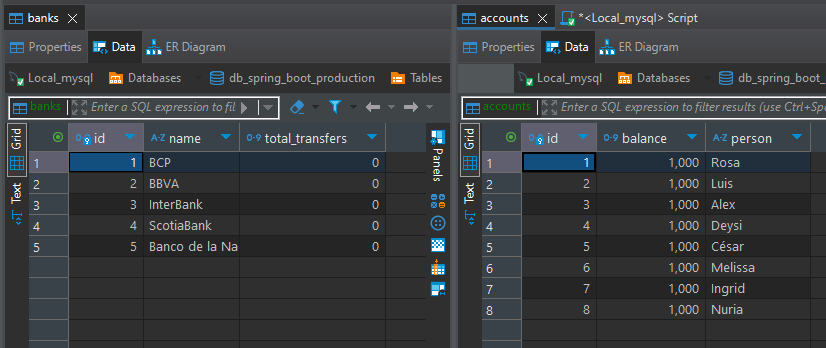

---

# Sección 4: Test de Servicios (Mockito)

---

## Escribiendo nuestros tests con JUnit y Mockito

Antes de continuar, revisemos la clase de test que Spring Boot crea cuando creamos un proyecto de Spring Boot:

````java

@SpringBootTest
class SpringBootTestApplicationTests {
    @Test
    void contextLoads() {
    }
}
````

- Por defecto nos crea una clase de prueba que tiene el nombre de la aplicación.
- Crea un método anotado con `@Test` que es una anotación de `JUnit 5` para indicarnos que será un método a testear.
- Anota la clase con `@SpringBootTest`, **¿Qué hace esta anotación?**

### @SpringBootTest

`Spring Boot` proporciona esta anotación para las `pruebas de integración.` Esta anotación crea un contexto para la
aplicación y carga el contexto completo de la aplicación.

`@SpringBootTest` arranca el contexto completo de la aplicación, lo que significa que podemos usar el `@Autowired` para
poder usar inyección de dependencia.

`@SpringBootTest` inicia el servidor embebido, crea un entorno web y a continuación, permite a los métodos test realizar
`pruebas de integración`.

Indica que la clase de prueba es una prueba de `Spring Boot` y proporciona una serie de características y
configuraciones específicas para realizar `pruebas de integración` en una aplicación de `Spring Boot`.

Al utilizar la anotación `@SpringBootTest`, se cargará el contexto de la aplicación de Spring Boot completo para la
prueba. Esto significa que se inicializarán todos los `componentes`, `configuraciones` y
`dependencias de la aplicación`, de manera similar a como se ejecutaría la aplicación en un entorno de producción. Esto
permite realizar `pruebas de integración` más realistas, donde se pueden probar las interacciones y el comportamiento
de la aplicación en un entorno similar al de producción.

**Nota**
> Como iniciaremos con `Pruebas Unitarias` eliminaremos la clase de prueba creada automáticamente, para dar
> paso a la creación de nuestra propia clase.

## Pruebas Unitarias para el servicio AccountServiceImpl (Mockeo manual)

A continuación se muestra la creación de nuestra clase de prueba para el servicio `AccountServiceImpl` con la creación
de un `test unitario` para el método `transfer()`.

````java
package dev.magadiflo.app.unitTest.service;

import dev.magadiflo.app.model.entity.Account;
import dev.magadiflo.app.model.entity.Bank;
import dev.magadiflo.app.repository.AccountRepository;
import dev.magadiflo.app.repository.BankRepository;
import dev.magadiflo.app.service.impl.AccountServiceImpl;
import org.junit.jupiter.api.BeforeEach;
import org.junit.jupiter.api.Test;

import java.math.BigDecimal;
import java.util.Optional;

import static org.junit.jupiter.api.Assertions.assertEquals;
import static org.mockito.ArgumentMatchers.any;
import static org.mockito.ArgumentMatchers.anyLong;
import static org.mockito.Mockito.*;
import static org.mockito.Mockito.verify;

class AccountServiceImplUnitTest {

    private AccountRepository accountRepository;
    private BankRepository bankRepository;
    private AccountServiceImpl accountService;

    private Long sourceAccountId;
    private Long targetAccountId;
    private Long bankId;
    private BigDecimal amount;
    private Account sourceAccount;
    private Account targetAccount;
    private Bank bank;

    @BeforeEach
    void setUp() {
        this.accountRepository = mock(AccountRepository.class);
        this.bankRepository = mock(BankRepository.class);
        this.accountService = new AccountServiceImpl(this.accountRepository, this.bankRepository);

        this.sourceAccountId = 1L;
        this.targetAccountId = 2L;
        this.bankId = 1L;
        this.amount = new BigDecimal("700");
        this.sourceAccount = new Account(1L, "Martín", new BigDecimal("2000"));
        this.targetAccount = new Account(2L, "Alicia", new BigDecimal("1000"));
        this.bank = new Bank(1L, "Banco de la Nación", 0);
    }

    @Test
    void shouldTransferAmountBetweenAccounts() {
        // given
        when(this.accountRepository.findById(this.sourceAccountId)).thenReturn(Optional.of(this.sourceAccount));
        when(this.accountRepository.findById(this.targetAccountId)).thenReturn(Optional.of(this.targetAccount));
        when(this.bankRepository.findById(this.bankId)).thenReturn(Optional.of(this.bank));

        // when
        this.accountService.transfer(this.bankId, this.sourceAccountId, this.targetAccountId, this.amount);

        // then
        assertEquals(BigDecimal.valueOf(1300), this.sourceAccount.getBalance());
        assertEquals(BigDecimal.valueOf(1700), this.targetAccount.getBalance());
        assertEquals(1, this.bank.getTotalTransfers());
        verify(this.accountRepository).findById(this.sourceAccountId);
        verify(this.accountRepository).findById(this.targetAccountId);
        verify(this.accountRepository, times(2)).findById(anyLong());
        verify(this.bankRepository).findById(this.bankId);
        verify(this.accountRepository).save(this.sourceAccount);
        verify(this.accountRepository).save(this.targetAccount);
        verify(this.accountRepository, times(2)).save(any(Account.class));
        verify(this.bankRepository).save(this.bank);
    }
}
````

**NOTA**

- En este curso, el profesor `Andrés Guzmán` dejó la clase anotada con `@SpringBootTest`, pero según lo que investigué
  y la información que coloqué en la parte superior, esta anotación es para `Pruebas de Integración`, es por eso que yo
  no uso esa anotación, ya que ahora estamos en `pruebas unitarias`. Además, solo estamos usando `JUnit` y `Mockito`
  para la realización de los `test unitarios`.


- Por el momento, `no hemos agregado ninguna anotación` sobre nuestra clase de prueba.


- En el método anotado con `@BeforeEach`, que es el método del ciclo de vida de `JUnit`, nos estamos apoyando de
  `Mockito` para crear manualmente las instancias `mockeadas` de las dependencias de nuestra clase de servicio que está
  bajo prueba. Para eso usamos el método estático de mockito `Mockito.mock(IAccountRepository.class)` y el
  `Mockito.mock(IBankRepository.class)`. Aunque, en nuestro caso la clase de `Mockito` la hemos importado de manera
  estática para usar directamente los métodos estáticos `mock()`.


- En el método anotado con `@BeforeEach` también estoy inicializando varias propiedades globales. Estos objetos serán
  utilizados en los distintos test, así que para evitar estar escribiendo lo mismo en cada test, simplemente los defino
  en el método `@BeforeEch`, para que cada vez que arranque un nuevo método test, los datos se vuelvan a inicializar.


- Usamos las `dependencias mockeadas manualmente` para crear nuestro objeto de prueba, quien requiere que se le pase
  por constructor dichas dependencias: `new AccountServiceImpl(this.accountRepository, this.bankRepository)`.


- Como resultado tenemos, nuestras dos dependencias mockeadas (`this.accountRepository` y `this.bankRepository`) y
  además tenemos nuestro objeto de servicio que es el que será sometido a los tests `this.accountService` que
  corresponde a la clase `AccountServiceImpl`.


- Sobre el método test `shouldTransferAmountBetweenAccounts()`, no hace falta explicar, es como lo hemos venido
  trabajando hasta ahora. Si ejecutamos esta clase de prueba, veremos que el `test pasará exitosamente`.

## Escribiendo tests assertThrow para afirmar que la excepción lanzada sea correcta

Crearemos un test para verificar que se esté lanzando nuestra excepción personalizada `InsufficientMoneyException`
cuando el monto a transferir sea mayor que el saldo disponible de la cuenta origen.

````java

class AccountServiceImplUnitTest {

    private AccountRepository accountRepository;
    private BankRepository bankRepository;
    private AccountServiceImpl accountService;

    private Long sourceAccountId;
    private Long targetAccountId;
    private Long bankId;
    private BigDecimal amount;
    private Account sourceAccount;
    private Account targetAccount;
    private Bank bank;

    @BeforeEach
    void setUp() {
        this.accountRepository = mock(AccountRepository.class);
        this.bankRepository = mock(BankRepository.class);
        this.accountService = new AccountServiceImpl(this.accountRepository, this.bankRepository);

        this.sourceAccountId = 1L;
        this.targetAccountId = 2L;
        this.bankId = 1L;
        this.amount = new BigDecimal("700");
        this.sourceAccount = new Account(1L, "Martín", new BigDecimal("2000"));
        this.targetAccount = new Account(2L, "Alicia", new BigDecimal("1000"));
        this.bank = new Bank(1L, "Banco de la Nación", 0);
    }

    @Test
    void shouldThrowAnExceptionWhenTheAmountToBeTransferredIsGreaterThanTheAvailableBalance() {
        // given
        this.amount = new BigDecimal("5000");
        when(this.accountRepository.findById(this.sourceAccountId)).thenReturn(Optional.of(this.sourceAccount));
        when(this.accountRepository.findById(this.targetAccountId)).thenReturn(Optional.of(this.targetAccount));
        when(this.bankRepository.findById(this.bankId)).thenReturn(Optional.of(bank));

        // when
        InsufficientMoneyException exception = assertThrows(InsufficientMoneyException.class, () -> {
            this.accountService.transfer(this.bankId, this.sourceAccountId, this.targetAccountId, this.amount);
        });

        // then
        assertEquals(InsufficientMoneyException.class, exception.getClass());
        assertEquals("El saldo es insuficiente", exception.getMessage());
        assertEquals(BigDecimal.valueOf(2000), this.sourceAccount.getBalance());
        assertEquals(BigDecimal.valueOf(1000), this.targetAccount.getBalance());
        assertEquals(0, this.bank.getTotalTransfers());
        verify(this.accountRepository).findById(this.sourceAccountId);
        verify(this.accountRepository).findById(this.targetAccountId);
        verify(this.accountRepository, times(2)).findById(anyLong());
        verify(this.bankRepository).findById(this.bankId);
        verify(this.accountRepository, never()).save(any(Account.class));
        verify(this.bankRepository, never()).save(this.bank);
    }

}
````

## Escribiendo test con los assertSame

A continuación explicamos el método de aserción de JUnit `assertSame()`:

- `Propósito`: Verifica si dos referencias apuntan al mismo objeto en memoria.
- `Comparación`: Compara las referencias de los objetos para ver si son idénticas (es decir, si apuntan al mismo objeto
  en el heap).
- `Uso`: Se utiliza cuando necesitas comprobar que dos variables se refieren al mismo objeto exacto en la memoria.

````java
class AccountServiceImplUnitTest {

    private AccountRepository accountRepository;
    private BankRepository bankRepository;
    private AccountServiceImpl accountService;

    private Long sourceAccountId;
    private Long targetAccountId;
    private Long bankId;
    private BigDecimal amount;
    private Account sourceAccount;
    private Account targetAccount;
    private Bank bank;

    @BeforeEach
    void setUp() {
        this.accountRepository = mock(AccountRepository.class);
        this.bankRepository = mock(BankRepository.class);
        this.accountService = new AccountServiceImpl(this.accountRepository, this.bankRepository);

        this.sourceAccountId = 1L;
        this.targetAccountId = 2L;
        this.bankId = 1L;
        this.amount = new BigDecimal("700");
        this.sourceAccount = new Account(1L, "Martín", new BigDecimal("2000"));
        this.targetAccount = new Account(2L, "Alicia", new BigDecimal("1000"));
        this.bank = new Bank(1L, "Banco de la Nación", 0);
    }

    @Test
    void shouldFindAccountById() {
        // given
        when(this.accountRepository.findById(1L)).thenReturn(Optional.of(this.sourceAccount));

        // when
        Optional<Account> accountDB = this.accountService.findById(1L);

        // then
        assertTrue(accountDB.isPresent());
        assertSame(this.sourceAccount, accountDB.get());
        verify(this.accountRepository).findById(1L);
    }
}
````

En este punto, sería bueno hacer una diferencia con el `assertEquals()`:

- `Propósito`: Verifica si dos objetos son "equivalentes" en términos de su contenido o valores.
- `Comparación`: Usa el método `equals()` del objeto para determinar si los dos objetos son iguales.
- `Uso`: Se utiliza cuando deseas comprobar que dos objetos tienen el mismo valor o estado, independientemente de si son
  la misma instancia en memoria.

## Escribe nuevos métodos de test

A continuación se muestras los test adicionales que se agregaron:

````java

class AccountServiceImplUnitTest {

    private AccountRepository accountRepository;
    private BankRepository bankRepository;
    private AccountServiceImpl accountService;

    private Long sourceAccountId;
    private Long targetAccountId;
    private Long bankId;
    private BigDecimal amount;
    private Account sourceAccount;
    private Account targetAccount;
    private Bank bank;

    @BeforeEach
    void setUp() {
        this.accountRepository = mock(AccountRepository.class);
        this.bankRepository = mock(BankRepository.class);
        this.accountService = new AccountServiceImpl(this.accountRepository, this.bankRepository);

        this.sourceAccountId = 1L;
        this.targetAccountId = 2L;
        this.bankId = 1L;
        this.amount = new BigDecimal("700");
        this.sourceAccount = new Account(1L, "Martín", new BigDecimal("2000"));
        this.targetAccount = new Account(2L, "Alicia", new BigDecimal("1000"));
        this.bank = new Bank(1L, "Banco de la Nación", 0);
    }

    /* other test methods */


    @Test
    void shouldThrowAnExceptionWhenTheSourceAccountDoesNotExist() {
        // given
        when(this.accountRepository.findById(this.sourceAccountId)).thenReturn(Optional.empty());
        when(this.accountRepository.findById(this.targetAccountId)).thenReturn(Optional.of(this.targetAccount));
        when(this.bankRepository.findById(this.bankId)).thenReturn(Optional.of(this.bank));

        // when
        NotFoundEntity notFoundEntity = assertThrows(NotFoundEntity.class, () -> {
            this.accountService.transfer(this.bankId, this.sourceAccountId, this.targetAccountId, this.amount);
        });

        // then
        assertEquals(NotFoundEntity.class, notFoundEntity.getClass());
        assertEquals("No existe la cuenta de origen con id " + this.sourceAccountId, notFoundEntity.getMessage());
        assertEquals(BigDecimal.valueOf(1000), this.targetAccount.getBalance());
        assertEquals(0, this.bank.getTotalTransfers());
        verify(this.accountRepository).findById(sourceAccountId);
        verify(this.accountRepository, never()).findById(targetAccountId);
        verify(this.accountRepository, times(1)).findById(anyLong());
        verify(this.bankRepository, never()).findById(bankId);
        verify(this.accountRepository, never()).save(any(Account.class));
        verify(this.bankRepository, never()).save(this.bank);
    }

    @Test
    void shouldThrowAnExceptionWhenTheTargetAccountDoesNotExist() {
        // given
        when(this.accountRepository.findById(this.sourceAccountId)).thenReturn(Optional.of(this.sourceAccount));
        when(this.accountRepository.findById(this.targetAccountId)).thenReturn(Optional.empty());
        when(this.bankRepository.findById(this.bankId)).thenReturn(Optional.of(this.bank));

        // when
        NotFoundEntity notFoundEntity = assertThrows(NotFoundEntity.class, () -> {
            this.accountService.transfer(this.bankId, this.sourceAccountId, this.targetAccountId, this.amount);
        });

        // then
        assertEquals(NotFoundEntity.class, notFoundEntity.getClass());
        assertEquals("No existe la cuenta de destino con id " + this.targetAccountId, notFoundEntity.getMessage());
        assertEquals(BigDecimal.valueOf(2000), this.sourceAccount.getBalance());
        assertEquals(0, this.bank.getTotalTransfers());
        verify(this.accountRepository).findById(this.sourceAccountId);
        verify(this.accountRepository).findById(this.targetAccountId);
        verify(this.accountRepository, times(2)).findById(anyLong());
        verify(this.bankRepository, never()).findById(this.bankId);
        verify(this.accountRepository, never()).save(any(Account.class));
        verify(this.bankRepository, never()).save(this.bank);
    }

    @Test
    void shouldThrowAnExceptionWhenTheBankDoesNotExist() {
        // given
        when(this.accountRepository.findById(this.sourceAccountId)).thenReturn(Optional.of(this.sourceAccount));
        when(this.accountRepository.findById(this.targetAccountId)).thenReturn(Optional.of(this.targetAccount));
        when(this.bankRepository.findById(this.bankId)).thenReturn(Optional.empty());

        // when
        NotFoundEntity notFoundEntity = assertThrows(NotFoundEntity.class, () -> {
            this.accountService.transfer(this.bankId, this.sourceAccountId, this.targetAccountId, this.amount);
        });

        // then
        assertEquals(NotFoundEntity.class, notFoundEntity.getClass());
        assertEquals("No existe el banco con el id " + this.bankId, notFoundEntity.getMessage());
        assertEquals(BigDecimal.valueOf(2000), this.sourceAccount.getBalance());
        assertEquals(BigDecimal.valueOf(1000), this.targetAccount.getBalance());
        verify(this.accountRepository).findById(this.sourceAccountId);
        verify(this.accountRepository).findById(this.targetAccountId);
        verify(this.accountRepository, times(2)).findById(anyLong());
        verify(this.bankRepository).findById(this.bankId);
        verify(this.accountRepository, never()).save(any(Account.class));
        verify(this.bankRepository, never()).save(any(Bank.class));
    }

    @Test
    void shouldReturnAnOptionalEmptyWhenTheAccountDoesNotExist() {
        // given
        when(this.accountRepository.findById(1L)).thenReturn(Optional.empty());

        // when
        Optional<Account> accountDB = this.accountService.findById(1L);

        // then
        assertTrue(accountDB.isEmpty());
        verify(this.accountRepository).findById(1L);
    }

    @Test
    void shouldGetTheBalanceOfAnAccount() {
        // given
        when(this.accountRepository.findById(1L)).thenReturn(Optional.of(this.sourceAccount));

        // when
        BigDecimal balance = this.accountService.reviewBalance(1L);

        // then
        assertEquals(BigDecimal.valueOf(2000), balance);
        verify(this.accountRepository).findById(1L);
        verify(this.accountRepository, times(1)).findById(anyLong());
    }

    @Test
    void shouldThrowAnExceptionWhenAccountDoesNotExist() {
        // given
        when(this.accountRepository.findById(1L)).thenReturn(Optional.empty());

        // when
        NotFoundEntity exception = assertThrows(NotFoundEntity.class, () -> {
            this.accountService.reviewBalance(1L);
        });

        // then
        assertEquals(NotFoundEntity.class, exception.getClass());
        assertEquals("No existe la cuenta con el id 1", exception.getMessage());
        verify(this.accountRepository).findById(1L);
        verify(this.accountRepository, times(1)).findById(anyLong());
    }

    @Test
    void shouldGetTheTotalTransfersFromTheBank() {
        // given
        this.bank.setTotalTransfers(10);
        when(this.bankRepository.findById(1L)).thenReturn(Optional.of(this.bank));

        // when
        int total = this.accountService.reviewTotalTransfers(1L);

        // then
        assertEquals(10, total);
        verify(this.bankRepository).findById(1L);
        verify(this.bankRepository, times(1)).findById(anyLong());
    }

    @Test
    void shouldThrowAnExceptionWhenTheBankDoesNotExistWhenReviewingTheTotalTransfers() {
        // given
        when(this.bankRepository.findById(1L)).thenReturn(Optional.empty());

        // when
        NotFoundEntity exception = assertThrows(NotFoundEntity.class, () -> {
            this.accountService.reviewTotalTransfers(1L);
        });

        // then
        assertEquals(NotFoundEntity.class, exception.getClass());
        assertEquals("No existe el banco con el id 1", exception.getMessage());
        verify(this.bankRepository).findById(1L);
        verify(this.bankRepository, times(1)).findById(anyLong());
    }
}
````

Si hasta este punto presionamos `Ctrl + Shift + F10` para ejecutar todas las pruebas unitarias creadas en la clase
`AccountServiceImplUnitTest`, veremos que todas pasarán exitosamente.


## Pruebas Unitarias para el servicio AccountServiceImpl (Mockeo con anotaciones de Mockito)

Crearemos una nueva clase de prueba para nuestro servicio `AccountServiceImpl` al que le llamaremos
`AccountServiceImplWithMockitoAnnotationsUnitTest`. Esta nueva clase de prueba contendrá los mismos métodos test que
creamos en la clase de prueba `AccountServiceImplUnitTest`. **¿Y para qué estamos creando otra clase con los mismos
métodos?**, pues en la clase `AccountServiceImplUnitTest` creamos los mocks de las dependencias de manera manual y
al mismo tiempo creamos el objeto de prueba (`this.accountService`) con dichos mocks, tal como se muestra a
continuación:

````java
class AccountServiceImplUnitTest {
    @BeforeEach
    void setUp() {
        this.accountRepository = mock(AccountRepository.class);
        this.bankRepository = mock(BankRepository.class);
        this.accountService = new AccountServiceImpl(this.accountRepository, this.bankRepository);
    }
}
````

Entonces lo que buscamos con esta nueva clase de test es crear los `Mocks` utilizando las anotaciones de `Mockito`, de
esta manera los `mocks` se crearán y se podrán inyectar al objeto de prueba de manera automática.

````java

@ExtendWith(MockitoExtension.class)                         //(1)
class AccountServiceImplWithMockitoAnnotationsUnitTest {

    @Mock                                                   //(2)
    private AccountRepository accountRepository;
    @Mock
    private BankRepository bankRepository;
    @InjectMocks                                            //(3)
    private AccountServiceImpl accountService;

    private Long sourceAccountId;
    private Long targetAccountId;
    private Long bankId;
    private BigDecimal amount;
    private Account sourceAccount;
    private Account targetAccount;
    private Bank bank;

    @BeforeEach
    void setUp() {
        this.sourceAccountId = 1L;
        this.targetAccountId = 2L;
        this.bankId = 1L;
        this.amount = new BigDecimal("700");
        this.sourceAccount = new Account(1L, "Martín", new BigDecimal("2000"));
        this.targetAccount = new Account(2L, "Alicia", new BigDecimal("1000"));
        this.bank = new Bank(1L, "Banco de la Nación", 0);
    }

    /* all test methods  */
}
````

**DONDE**

- `(1)` por norma general, para crear los test unitarios sobre los `servicios y/o componentes` simplemente debemos de
  definir tests que funcionen con la extensión de Mockito `@ExtendWith(MockitoExtension.class)`. Esta anotación nos
  permite habilitar las anotaciones de mockito: `@Mock`, `@InjectMocks`, `@Spy`, entre otras.


- `(2)` es la anotación de mockito que nos permite `mockear` las dependencias sobre las que están anotadas. En
  nuestro caso, nos permite crear un mock del `AccountRepository` y del `BankRepository`.


- `(3)` nos permite inyectar los mocks anteriormente definidos `AccountRepository` y el `BankRepository` en la
  instancia del `AccountServiceImpl`.

> **¡Importante!** el `@InjectMocks` tiene que estar anotada sobre una clase concreta.

Es importante resaltar que aún seguimos haciendo uso del método anotado con `@BeforeEach`, dado que ese método se
ejecuta antes de ejecutarse cada método de test, lo necesitamos para inicializar los atributos que necesitamos para
cada método test.

Y eso es todo, si ejecutamos los test de nuestra nueva clase, veremos que todo seguirá funcionando como antes, pero esta
vez estamos creando los `Mocks` usando las anotaciones de `Mockito`.

## Pruebas Unitarias para el servicio AccountServiceImpl (Mockeo con anotaciones de Spring Boot)

Creamos una nueva clase de prueba con los mismos test que hemos venido realizando hasta ahora, lo único que cambiará
serán las anotaciones que usaremos.

````java

@SpringBootTest(classes = AccountServiceImpl.class)
class AccountServiceImplSpringBootAnnotationsTest {

    @MockBean
    private AccountRepository accountRepository;
    @MockBean
    private BankRepository bankRepository;
    @Autowired
    private AccountService accountService;

    private Long sourceAccountId;
    private Long targetAccountId;
    private Long bankId;
    private BigDecimal amount;
    private Account sourceAccount;
    private Account targetAccount;
    private Bank bank;

    @BeforeEach
    void setUp() {
        this.sourceAccountId = 1L;
        this.targetAccountId = 2L;
        this.bankId = 1L;
        this.amount = new BigDecimal("700");
        this.sourceAccount = new Account(1L, "Martín", new BigDecimal("2000"));
        this.targetAccount = new Account(2L, "Alicia", new BigDecimal("1000"));
        this.bank = new Bank(1L, "Banco de la Nación", 0);
    }

    /* all test methods  */
}
````

Anteriormente, ya habíamos explicado el uso de la anotación `@SpringBootTest`, donde decíamos que Spring Boot
proporciona esta anotación para las `pruebas de integración`. Esta anotación crea un contexto para la aplicación y
`carga el contexto completo de la aplicación`.

En ese sentido, para evitar que `@SpringBootTest` nos cargue todo el contexto completo de la aplicación, es que vamos
a delimitar la ejecución de esta clase de test al uso de la clase `AccountServiceImpl.class`, en otras palabras
cuando usamos la siguiente línea `@SpringBootTest(classes = AccountServiceImpl.class)` le estamos diciendo a Spring
Boot que solo debe cargar la clase `AccountServiceImpl.class` durante la prueba.

Si usas la anotación `@SpringBootTest` sin ningún otro valor como parámetro, **Spring Boot intentará cargar toda la
configuración de tu aplicación durante la prueba. Esto incluirá la configuración de los componentes de tu aplicación,
como controladores, servicios, repositorios, y cualquier otra configuración que esté presente en tu proyecto.**

En muchos casos, esto no es un problema y puede simplificar la escritura de pruebas, ya que no necesitas especificar
qué clases cargar explícitamente. Sin embargo, cargar toda la configuración puede hacer que las pruebas sean más lentas
y complejas, especialmente si tienes una aplicación grande con muchas dependencias.

Por otro lado, especificar la clase con la anotación `@SpringBootTest(classes = AccountServiceImpl.class)` limita la
carga de la configuración solo a la clase especificada y las clases que esta clase utiliza directa o indirectamente.
Esto puede hacer que las pruebas sean más rápidas y más enfocadas, ya que solo se carga lo necesario para la clase que
estás probando.

Por lo tanto, en esta clase de test usaremos la configuración `@SpringBootTest(classes = AccountServiceImpl.class)`,
dado que estamos realizando `pruebas unitarias` a la clase de servicio `AccountServiceImpl` y no requerimos que se
nos cargue todo un contexto de la aplicación.

> Más adelante determinaremos que lo mejor para realizar `pruebas unitarias` a `servicios` y/o `componentes` será
> hacer uso del `Mockito.mock()` o la anotación `@Mock`.

### @MockBean

Si hacemos uso de la anotación `@SpringBootTest` podemos hacer uso de la anotación de Spring Boot, el `@MockBean`.
La anotación `@MockBean` agrega objetos simulados al contexto de la aplicación de Spring (`@SpringBootTest` crea ese
contexto para la aplicación). El objeto mockeado reemplazará a cualquier bean existente del mismo tipo en el contexto
de la aplicación. Si no se define un bean del mismo tipo, se agregará uno nuevo. **En resumen, cuando utilicemos la
anotación `@MockBean` en un campo, el mock se inyectará en el campo, además de registrarse en el contexto de la
aplicación.**

### @Autowired

Nos permite inyectar la implementación concreta en la instancia de la interfaz `AccountService`. Precisamente, dicha
implementación concreta es la que está bajo prueba.

````java

@Slf4j
@RequiredArgsConstructor
@Service
public class AccountServiceImpl implements AccountService {
    /* other codes */
}
````

Listo, si ejecutamos nuestra nueva clase de test `AccountServiceImplWithSpringBootAnnotationsUnitTest` veremos que
se ejecutará exitosamente, con una observación: **Ahora se está creando un contexto para la aplicación**, es por esa
razón que cuando ejecutamos el test de dicha clase, vemos que en la consola aparece la presentación clásica de
Spring Boot.

## Pruebas unitarias a servicios: Mockito.mock() o @Mock vs @MockBean

> Cuando realicemos pruebas a nuestra clase de `servicio` o `componente`, lo recomendable sería utilizar lo concerniente
> a `Mockito`, ya sea `Mockito.mock()` o `@Mock`, dado que de esa manera los test no levantarán ningún contexto de
> Spring, por lo que su tiempo de ejecución es muy rápido.
> [Fuente: cloudAppi](https://cloudappi.net/testing-en-spring-boot/)

Mientras que, `@MockBean` anotado en un campo de una clase de prueba, Spring Boot creará automáticamente un
objeto simulado (mock) de la dependencia correspondiente y lo inyectará en la clase. Esto permite simular el
comportamiento de la dependencia y definir respuestas predefinidas para los métodos llamados durante la prueba.
`Generalmente, se usará esta anotación en otras capas de la aplicación, como el controlador.`

---

# Sección 5: Test de Repositorios (DataJpaTest)

---

## Agrega dependencia de H2 para ejecución de test

Vamos a agregar la dependencia de `h2` al archivo `pom.xml` del proyecto, para ver cómo realizar pruebas de integración
a nuestro repositorio, usando una base de datos en memoria. Posteriormente, eliminaremos esta dependencia, ya que
trabajaremos exclusivamente con la dependencia de `MySQL` cuya conexión apuntará a una base de datos de pruebas.

````xml

<dependency>
    <groupId>com.h2database</groupId>
    <artifactId>h2</artifactId>
    <scope>test</scope>
</dependency>
````

Ahora, en el directorio `/test` crearemos el subdirectorio `/resources` similar al que tenemos en el directorio `/main`.
Vamos a crear el archivo de configuración `application.yml` propio para los test. Este archivo de configuración
contendrá propiedades relacionadas a las pruebas de la aplicación.

**NOTA**

> En `IntelliJ IDEA` demos click derecho al directorio `/resource` creado y vamos a la opción de `Mark Directory as`,
> debemos observar que esté con: `Unmark as Test Resources Root`. De esa manera confirmamos que dicho directorio
> sí esta marcado como raíz de recursos de prueba.

En el archivo `src/test/resources/application.yml` que agregamos anteriormente, colocamos las configuraciones que tendrá
para la realización de los distintos test.

````yml
spring:
  datasource:
    url: jdbc:h2:mem:db_test;DB_CLOSE_ON_EXIT=FALSE
    username: admin
    password: magadiflo

  jpa:
    hibernate:
      ddl-auto: create
    properties:
      hibernate:
        format_sql: true

logging:
  level:
    org.hibernate.SQL: DEBUG
````

**DONDE**

- `db_test`, nombre que le damos a la base de datos que se creará en memoria o a la que se conectará la aplicación.
- `DB_CLOSE_ON_EXIT=FALSE`, esta parte de la URL es una opción específica de `H2`. Con esta configuración, se está
  indicando que la base de datos no se cerrará automáticamente al salir de la aplicación Spring Boot. Esto permite que
  la base de datos permanezca en memoria incluso después de que la aplicación se detenga, lo que puede ser útil para
  fines de depuración y pruebas.

**NOTA**

> La base de datos `h2` es una base de datos en memoria, solo se necesita agregar la dependencia en el `pom.xml` e
> inmediatamente se autoconfigura, es decir no necesitamos agregar configuraciones en el `application.yml` para que
> funcione, sino más bien, `por defecto se autoconfigura`, pero también podemos realizar configuraciones
> personalizadas como habilitar la consola h2 usando esta configuración: `spring.h2.console.enabled=true`, entre
> otros.
>
> **¿y esas configuraciones del datasource que puse en el application.yml?** Son configuraciones que permiten
> crear un datasource para cualquier base de datos, en este caso usé dichas configuraciones para configurar la base de
> datos h2 tal como lo hubiera realizado configurando una base de datos real. Pero las puse con la finalidad de que más
> adelante usaré una base de datos real, entonces solo tendría que cambiar los datos de conexión.
>
> `Conclusión`: si solo usaré la base de datos `h2` para realizar las pruebas, tan solo agregando la dependencia de
> h2 ya estaría configurada el `datasource`, pero si luego usaré una base de datos real para las pruebas, podría usar
> la configuración que puse para tan solo cambiar los datos de conexión.

Ahora, dentro de `src/test/resources` creamos el archivo `import.sql` para poder poblar las tablas de nuestra base
de datos con datos de prueba.

````sql
INSERT INTO banks(name, total_transfers) VALUES('Banco de la Nación', 0);
INSERT INTO accounts(person, balance) VALUES('Martín', 2000);
INSERT INTO accounts(person, balance) VALUES('Alicia', 1000);
````

## Pruebas de Integración con @DataJpaTest usando H2

Antes de continuar, mencionaré el `por qué` se llama `Prueba de Integración` al usar la anotación `@DataJpaTest`
y no `Prueba Unitaria`. Recordemos que en el tutorial de `Amigoscode` de test con Spring Boot se usa también esta
anotación para testear el repositorio, pero `solo para testear los métodos que nosotros agreguemos a la interfaz`,
a esa acción el tutor lo llama prueba unitaria del repositorio.

**[Fuente: stack overflow](https://stackoverflow.com/questions/23435937/how-to-test-spring-data-repositories)**

> Para abreviar, no hay forma de realizar `pruebas unitarias` de los repositorios `Spring Data JPA` razonablemente por
> una razón simple: es demasiado engorroso simular todas las partes de la API JPA que invocamos para arrancar los
> repositorios. De todos modos, las pruebas unitarias no tienen mucho sentido aquí, ya que normalmente no está
> escribiendo ningún código de implementación usted mismo, por lo que las `pruebas de integración` son el enfoque más
> razonable.
>
> Si lo piensa, **no hay código que escriba para sus repositorios, por lo que no hay necesidad de escribir pruebas
> unitarias.** Simplemente, no hay necesidad de hacerlo, ya que puede confiar en nuestra base de prueba para detectar
> errores básicos. Sin embargo, definitivamente `se necesitan pruebas de integración` para probar dos aspectos de su
> capa de persistencia, porque son los aspectos relacionados con su dominio:
>
> * Entity mappings
> * Query semantics

Puedo añadir además, que cuando hablamos de `Pruebas Unitarias` nos referimos a la verificación o comprobación del
correcto funcionamiento de las `piezas de código de manera individual, en forma aislada`. Mientras que, una
`Prueba de integración` se realiza para verificar la `interacción entre distintos módulos`, y si recordamos nosotros
agregamos una dependencia para usar base de datos en memoria, es decir, las pruebas que haremos **interactuarán con un
módulo de base de datos**, por lo tanto, podemos decir que las pruebas a crear serán `Pruebas de integración`.

### [La anotación @DataJpaTest](https://docs.spring.io/spring-boot/docs/1.5.2.RELEASE/reference/html/boot-features-testing.html)

`@DataJpaTest` se puede usar si desea probar aplicaciones JPA. De forma predeterminada, `configurará una base de datos
incrustada en memoria`, buscará clases `@Entity` y configurará repositorios de `Spring Data JPA`, es decir que
solo probará los componentes de la capa de `repositorio/persistencia`.

La anotación `@DataJpaTest` no cargará los otros beans en el `ApplicationContext`: `@Component`, `@Controller`,
`@Service` y beans anotados.

La anotación `@DataJpaTest` habilita la configuración específica de JPA para la prueba y se utilizan las inyecciones
de dependencia para acceder a los componentes de JPA (repositorios) que se desean probar.

`Los datos de prueba de JPA son transaccionales y retroceden al final de cada prueba de forma predeterminada`. Es
decir, cada método de prueba anotado con `@DataJpaTest` se ejecutará dentro de una transacción, y al final de cada
prueba, la transacción se revertirá automáticamente, evitando así que los cambios de la prueba afecten la base de datos.

> Esto se diferencia de las pruebas unitarias, donde se aísla una unidad de código (como un método o clase) y se prueban
> sus funcionalidades de forma independiente, `sin depender de clases externas o bases de datos`.

**IMPORTANTE**

> `Deberíamos probar únicamente los métodos que nosotros hayamos creado (los métodos personalizados para hacer 
> consultas a la bd)`. Obviamente, como extendemos de alguna interfaz de Spring Data Jpa, tendremos muchos métodos,
> como el: `save()`, `findById()`, `findAll()`, etc. pero dichos métodos son métodos que ya vienen probados, puesto que
> nos lo proporciona Spring Data Jpa.
>
> Por tema de aprendizaje, en este curso probamos algunos métodos propios de las interfaces de Spring Data Jpa y por
> supuesto, también probamos los métodos personalizados que he creado en la interfaz de repositorio.

## Crea prueba de integración con @DataJpaTest

Probamos nuestro repositorio `AccountRepository`, para ello nos posicionamos en el repositorio y presionamos
`Ctrl + Shift + T` para crear un test a partir de nuestro repositorio. El nombre que le definiremos será
`AccountRepositoryIntegrationTest`.

````java

@DataJpaTest                                        //(1)
class AccountRepositoryIntegrationTest {

    @Autowired
    private AccountRepository accountRepository;    //(2)

    @Test
    void shouldFindAnAccountById() {
        // given
        Long accountId = 1L;

        // when
        Optional<Account> accountOptional = this.accountRepository.findById(accountId);

        // then
        assertTrue(accountOptional.isPresent());
        assertEquals(1L, accountOptional.get().getId());
        assertEquals("Martín", accountOptional.get().getPerson());
        assertEquals(2000D, accountOptional.get().getBalance().doubleValue());
    }

    @Test
    void shouldFindAnAccountByPerson() {
        // given
        String person = "Martín";

        // when
        Optional<Account> accountOptional = this.accountRepository.findAccountByPerson(person);

        // then
        assertTrue(accountOptional.isPresent());
        assertEquals(1L, accountOptional.get().getId());
        assertEquals("Martín", accountOptional.get().getPerson());
        assertEquals(2000D, accountOptional.get().getBalance().doubleValue());
    }

    @Test
    void shouldReturnAnEmptyOptionalWhenAAccountDoesNotExistSearchedForByPerson() {
        // given
        String person = "Ronaldo";

        // when
        Optional<Account> accountOptional = this.accountRepository.findAccountByPerson(person);

        // then
        assertTrue(accountOptional.isEmpty());
    }

    @Test
    void shouldSaveAnAccount() {
        // given
        Account accountToSave = Account.builder()
                .person("Eli")
                .balance(new BigDecimal("2500"))
                .build();

        // when
        Integer affectedRows = this.accountRepository.saveAccount(accountToSave);
        Optional<Account> accountOptional = this.accountRepository.findById(3L);

        // then
        assertNotNull(affectedRows);
        assertEquals(1, affectedRows);
        assertTrue(accountOptional.isPresent());
        assertEquals(3L, accountOptional.get().getId());
        assertEquals(accountToSave.getPerson(), accountOptional.get().getPerson());
        assertEquals(accountToSave.getBalance().doubleValue(), accountOptional.get().getBalance().doubleValue());
    }

    @Test
    void shouldUpdateAnAccount() {
        // given
        Account accountToUpdate = Account.builder()
                .id(1L)
                .person("Gaspar")
                .balance(new BigDecimal("5000"))
                .build();

        // when
        Integer affectedRows = this.accountRepository.updateAccount(accountToUpdate);
        Optional<Account> accountOptional = this.accountRepository.findById(1L);

        // then
        assertNotNull(affectedRows);
        assertEquals(1, affectedRows);
        assertTrue(accountOptional.isPresent());
        assertEquals(accountToUpdate.getPerson(), accountOptional.get().getPerson());
        assertEquals(accountToUpdate.getBalance().doubleValue(), accountOptional.get().getBalance().doubleValue());
    }

    @Test
    void shouldDeletedAnAccount() {
        // given
        Long accountId = 1L;

        // when
        Integer affectedRows = this.accountRepository.deleteAccountById(accountId);
        Optional<Account> accountOptional = this.accountRepository.findById(accountId);

        // then
        assertNotNull(affectedRows);
        assertEquals(1, affectedRows);
        assertTrue(accountOptional.isEmpty());
    }
}
````

**DONDE**

- `(1)`, anotación que nos permite realizar pruebas a nuestros repositorios de Spring Data JPA.
- `(2)`, realizamos la inyección de dependencia de nuestro repositorio a probar. Esto es posible gracias a la anotación
  `@DataJpaTest`.
- Por defecto, gracias a la anotación `@DataJpaTest`, `cada método @Test es transaccional`, es decir, apenas termine la
  ejecución de un método test, automáticamente se hace un `rollback` de los datos para que se lleve a cabo la ejecución
  del siguiente test.

Como resultado observamos que los tests se ejecutan correctamente:

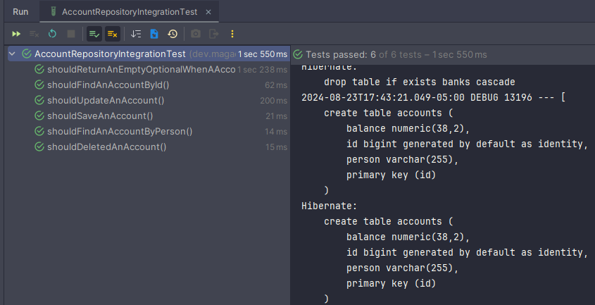

> Recordemos que hemos ejecutado las pruebas de integración anteriores contra una base de datos h2 (en memoria).

## Pruebas de Integración con @DataJpaTest usando MySQL

Para ejecutar las pruebas de integración utilizando `MySQL`, lo primero que haremos será, eliminar la dependencia de
`h2` que agregamos en el `pom.xml`, dejando únicamente la dependencia de `MySQL`.

Luego, en el `src/test/resources/application.yml` cambiamos la url de conexión por la conexión a `mysql`.

````yml
spring:
  datasource:
    url: jdbc:mysql://localhost:3306/db_spring_boot_test
    username: admin
    password: magadiflo

  jpa:
    hibernate:
      ddl-auto: create
    properties:
      hibernate:
        format_sql: true

logging:
  level:
    org.hibernate.SQL: DEBUG
````

Es importante notar que estas configuraciones son configuraciones para pruebas, es por eso que la base de datos
que estamos usando es una base de datos distinta al que tenemos en producción. Aquí, nuestra base de datos se llamará
`db_spring_boot_test` y es completamente distinta al de producción llamado `db_spring_boot_production`.

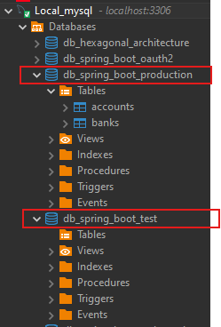

Finalmente, a nuestra clase de prueba le agregamos una segunda anotación `@AutoConfigureTestDatabase()`.

````java

@DataJpaTest
@AutoConfigureTestDatabase(replace = AutoConfigureTestDatabase.Replace.NONE)
class AccountRepositoryIntegrationTest {

    @Autowired
    private AccountRepository accountRepository;

    /* other tests */
}
````

Al usar la anotación `@AutoConfigureTestDatabase(replace = Replace.NONE)`, le indicas a Spring Boot que no debe
reemplazar el `DataSource` configurado en tu archivo `application.yml` de pruebas con una base de datos en memoria.
Esto significa que Spring Boot utilizará exactamente la configuración que has definido para conectar tu aplicación de
prueba a `MySQL` (u otra base de datos externa) en lugar de intentar usar `H2`, HSQLDB, o Derby.

**En resumen:**

- Sin `@AutoConfigureTestDatabase(replace = Replace.NONE)`, Spring Boot intentará reemplazar cualquier configuración de
  DataSource con una base de datos en memoria, si está disponible.


- Con `@AutoConfigureTestDatabase(replace = Replace.NONE)`, Spring Boot utilizará el DataSource que tú has configurado
  en `src/test/resources/application.yml`, que en tu caso sería `MySQL`.

Antes de ejecutar las pruebas de integración, verificamos cómo es que tenemos la base de datos, tanto la de producción
como la de pruebas. Claramente, observamos que la base de datos de producción tiene dos tablas y sus datos, mientras que
la base de datos de pruebas no tiene tablas creadas.

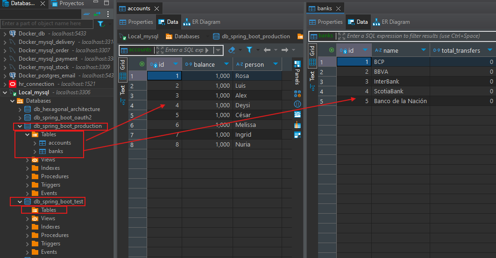

Ahora, procedemos a ejecutar las pruebas de integración usando mysql.

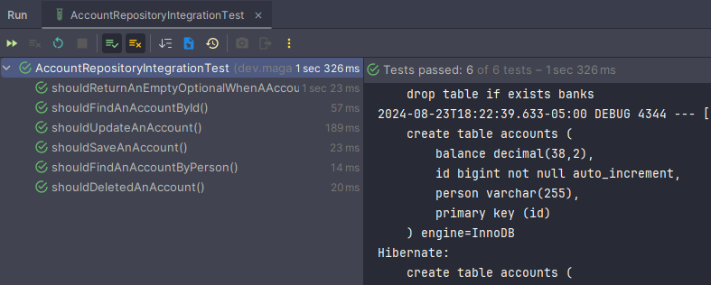

Observamos en el resultado anterior que los tests se han ejecutado exitosamente. Ahora, revisemos las bases de datos de
producción y de pruebas. Podemos ver que la base de datos de producción se mantiene tal cual, no hubo interacción de
los test de integración con dicha base de datos. Por otro lado, la base de datos de prueba, esta vez muestra que
se han creado dos tablas y dentro de ellas los datos que definimos en el apartado inicial de esta `sección 5`.

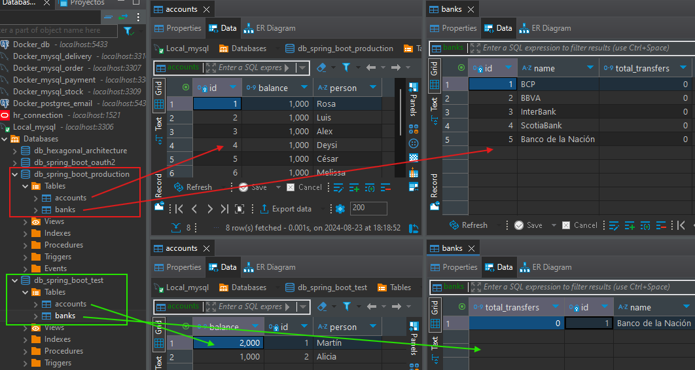

---

# Sección 6: Pruebas Unitarias para Controladores con MockMvc (@WebMvcTest)

---

Antes de continuar con esta sección, voy a definir algunos términos que más adelante nos serán útil entender qué es lo
que hacen.

### @WebMvcTest

- Anotación que se puede usar para una prueba de `Spring MVC` que se centra solo en los componentes de `Spring MVC`.


- El uso de esta anotación `deshabilitará la configuración automática completa` y, en su lugar, aplicará solo la
  configuración relevante para las pruebas de MVC, es decir, `habilitará` los beans `@Controller`, `@ControllerAdvice`,
  `@JsonComponent`, `Converter/GenericConverter`, `Filter`, `WebMvcConfigurer` y `HandlerMethodArgumentResolver`,
  `pero no` los beans `@Component`, `@Service` o `@Repository` beans.


- De forma predeterminada, las pruebas anotadas con `@WebMvcTest` también configurarán automáticamente `Spring Security`
  y `MockMvc`.


- Por lo general, `@WebMvcTest` se usa en combinación con `@MockBean` o `@Import` para crear cualquier colaborador
  requerido por sus beans `@Controller`.


- Spring nos brinda la anotación `@WebMvcTest` para facilitarnos los test unitarios en de nuestros controladores.


- Si colocamos la clase de controlador dentro de la anotación `@WebMvcTest(AccountController.class)`, estamos
  indicándole que realizaremos las pruebas unitarias específicamente al controlador definido dentro de la anotación.

### MockMvc

- La anotación `@WebMvcTest` permite especificar el controlador que se quiere probar y tiene el efecto añadido que
  registra algunos beans de Spring, en particular una instancia de la clase `MockMvc`, que se puede utilizar para
  invocar al controlador `simulando la llamada HTTP` sin tener que arrancar realmente ningún servidor web.


- Es el contexto de `MVC`, pero falso, el servidor HTTP es simulado: `request`, `response`, etc. es decir, no estamos
  trabajando sobre un servidor real HTTP, lo que facilita la escritura de pruebas para controladores sin tener que
  iniciar un servidor web real.


- `MockMvc` ofrece una interfaz para realizar solicitudes `HTTP (GET, POST, PUT, DELETE, etc.)` a los endpoints de
  tus controladores y obtener las respuestas simuladas. Esto es especialmente útil para probar el comportamiento de
  tus controladores sin realizar solicitudes reales a una base de datos o a servicios externos.

### @MockBean

- La anotación `@MockBean` permite simular (mockear) el objeto sobre el cual esté anotado. Al utilizar `@MockBean`,
  Spring Boot reemplaza el bean original con el objeto simulado en el contexto de la aplicación durante la ejecución de
  la prueba.


- Como se mencionaba en el apartado `@WebMvcTest`, por lo general, `@WebMvcTest` se usa en combinación con
  `@MockBean` o `@Import` para crear cualquier colaborador requerido por sus beans `@Controller`.

### ResultActions

Permite aplicar acciones, como expectativas, sobre el resultado de una solicitud ejecutada, es decir, con esta clase
manejamos la respuesta del API REST.

### ObjectMapper

- Nos permitirá convertir cualquier objeto en un JSON y viceversa, un JSON en un objeto que por supuesto debe existir la
  clase a la que será convertido, donde los atributos de la clase coincidan con los nombres de los atributos del json y
  viceversa.


- `ObjectMapper` proporciona funcionalidad para leer y escribir JSON, ya sea hacia y desde POJO básicos (Plain Old Java
  Objects) o hacia y desde un modelo de árbol JSON de propósito general (JsonNode), así como la funcionalidad
  relacionada para realizar conversiones.

## Creando Prueba Unitaria al controlador AccountController

En el apartado anterior, coloqué algunas definiciones de anotaciones y objetos que usaremos para crear nuestra prueba
unitaria de los métodos del controlador, de esa manera tener más claro qué es lo que hace cada uno.

````java

@WebMvcTest(AccountController.class)
class AccountControllerUnitTest {

    @Autowired
    private MockMvc mockMvc;

    @Autowired
    private ObjectMapper objectMapper;

    @MockBean
    private AccountService accountService;

    @Test
    void shouldFindAllAccounts() throws Exception {
        // given
        List<Account> accounts = List.of(
                new Account(1L, "Martín", new BigDecimal("2000")),
                new Account(2L, "Alicia", new BigDecimal("1000"))
        );
        when(this.accountService.findAll()).thenReturn(accounts);

        // when
        ResultActions response = this.mockMvc.perform(get("/api/v1/accounts"));

        // then
        response.andExpect(status().isOk())
                .andExpect(content().contentType(MediaType.APPLICATION_JSON))
                .andExpect(jsonPath("$[0].person").value("Martín"))
                .andExpect(jsonPath("$[0].balance").value(2000))
                .andExpect(jsonPath("$[1].person").value("Alicia"))
                .andExpect(jsonPath("$[1].balance").value(1000))
                .andExpect(jsonPath("$.size()", Matchers.is(accounts.size())))
                .andExpect(jsonPath("$", Matchers.hasSize(accounts.size())))
                .andExpect(content().json(this.objectMapper.writeValueAsString(accounts)));
    }

    @Test
    void shouldSaveAnAccount() throws Exception {
        // given
        Account account = Account.builder()
                .person("Martín")
                .balance(new BigDecimal("2000"))
                .build();
        when(this.accountService.save(account)).then(invocation -> {
            Account accountResponse = invocation.getArgument(0);
            accountResponse.setId(1L);
            return accountResponse;
        });

        // when
        ResultActions response = this.mockMvc.perform(post("/api/v1/accounts")
                .contentType(MediaType.APPLICATION_JSON)
                .content(this.objectMapper.writeValueAsString(account)));

        // then
        response.andExpect(status().isCreated())
                .andExpect(content().contentType(MediaType.APPLICATION_JSON))
                .andExpect(header().string("Location", "/api/v1/accounts/1"))
                .andExpect(jsonPath("$.id", Matchers.is(1)))
                .andExpect(jsonPath("$.person", Matchers.is("Martín")))
                .andExpect(jsonPath("$.balance", Matchers.is(2000)));
    }

    @Test
    void shouldFindAnAccount() throws Exception {
        // given
        Long accountId = 1L;
        Account account = new Account(1L, "Martín", new BigDecimal("2000"));
        when(this.accountService.findById(accountId)).thenReturn(Optional.of(account));

        // when
        ResultActions response = this.mockMvc.perform(get("/api/v1/accounts/{accountId}", accountId));

        // then
        response.andExpect(status().isOk())
                .andExpect(content().contentType(MediaType.APPLICATION_JSON))
                .andExpect(jsonPath("$.person").value("Martín"))
                .andExpect(jsonPath("$.balance").value(2000));
        verify(this.accountService).findById(accountId);
        verify(this.accountService).findById(anyLong());
    }

    @Test
    void shouldReturnANotFoundStatusWhenTheAccountDoesNotExist() throws Exception {
        // given
        Long accountId = 100L;
        when(this.accountService.findById(accountId)).thenReturn(Optional.empty());

        // when
        ResultActions response = this.mockMvc.perform(get("/api/v1/accounts/{accountId}", accountId));

        // then
        response.andExpect(status().isNotFound());
        verify(this.accountService).findById(accountId);
        verify(this.accountService).findById(anyLong());
    }

    @Test
    void shouldTransferAnAmountBetweenAccounts() throws Exception {
        // given
        Transaction dto = new Transaction(1L, 1L, 2L, new BigDecimal("100"));
        doNothing().when(this.accountService).transfer(dto.bankId(), dto.sourceAccountId(), dto.targetAccountId(), dto.amount());

        // when
        ResultActions response = this.mockMvc.perform(post("/api/v1/accounts/transfer")
                .contentType(MediaType.APPLICATION_JSON)
                .content(this.objectMapper.writeValueAsString(dto)));

        // then
        response.andExpect(status().isCreated())
                .andExpect(content().contentType(MediaType.APPLICATION_JSON))
                .andExpect(jsonPath("$.code").value(HttpStatus.CREATED.value()))
                .andExpect(jsonPath("$.datetime").exists())
                .andExpect(jsonPath("$.message").value("Transferencia exitosa"))
                .andExpect(jsonPath("$.transaction.sourceAccountId").value(dto.sourceAccountId()));

        String jsonResponse = response.andReturn().getResponse().getContentAsString();
        JsonNode jsonNode = this.objectMapper.readTree(jsonResponse);

        String dateTime = jsonNode.get("datetime").asText();
        LocalDateTime localDateTime = LocalDateTime.parse(dateTime);

        assertEquals(LocalDate.now(), localDateTime.toLocalDate());
    }
}
````

Si ejecutamos las pruebas unitarias del controlador veremos que las pruebas pasan exitosamente.

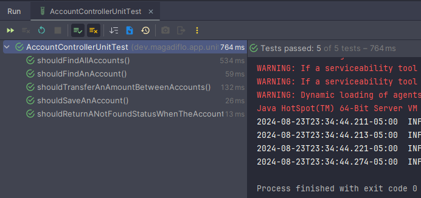

## Ejecutando tests con cobertura de código (Code Coverage)

Para ver la cobertura de los test realizados vamos a la `raíz del proyecto`, damos `clic secundario` y
seleccionamos `Run 'All Tests' with Coverage`. Se ejecutarán todos nuestros test: `unitarios` y de `integración` para
finalmente mostrarnos el siguiente resultado.

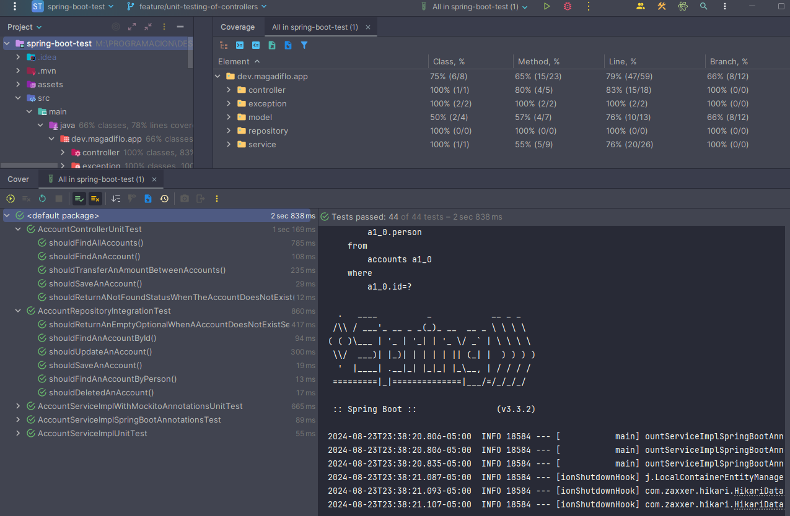

---

# Sección 7: Pruebas de Integración de Controladores Rest con WebTestClient

---

## Pruebas de Integración: con WebClient

En esta sección realizaremos `pruebas reales` a nuestros endpoints, eso significa que `no usaremos MockMvc` para
simular las peticiones como lo hicimos en la sección anterior, aunque, viendo el tutorial de
[JavaGuides](https://www.javaguides.net/2022/03/spring-boot-integration-testing-mysql-crud-rest-api-tutorial.html#google_vignette),
allí sí usa el `MockMvc` con ciertas configuraciones para que la petición realizada sean a los endpoints reales y no
simulados, pero para nuestro caso usaremos los clientes HTTP proporcionados por Spring.

Para realizar estas pruebas de integración de nuestros endpoints, usaremos clientes HTTP, como `WebClient` y
`RestTemplate`; estos son los principales clientes que SpringBoot ofrece para consumir Servicios Rest. En esta sección
trabajaremos con `WebClient`.

> Siempre trabajaremos con un único cliente http para realizar pruebas de integración, ya sea utilizando `RestTemplate`
> o `WebClient`.

### WebClient

`Spring WebFlux` incluye un cliente para realizar solicitudes HTTP. `WebClient` tiene una API funcional y fluida basada
en Reactor. Es completamente sin bloqueo, admite transmisión y se basa en los mismos códecs que también se utilizan
para codificar y decodificar contenido de solicitud y respuesta en el lado del servidor.

`WebClient` es un cliente HTTP de Spring que permite realizar solicitudes HTTP de manera reactiva y no bloqueante
en aplicaciones basadas en Spring. Es una opción recomendada para nuevas aplicaciones y reemplaza gradualmente a
`RestTemplate` en el ecosistema de Spring.

### WebTestClient

`WebTestClient` es un cliente HTTP diseñado para probar aplicaciones de servidor. `Envuelve el WebClient de Spring`
y lo usa para realizar solicitudes, pero expone una fachada de prueba para verificar las respuestas. `WebTestClient`
se puede utilizar para realizar pruebas HTTP de extremo a extremo. También se puede usar para probar aplicaciones
`Spring MVC` y `Spring WebFlux` sin un servidor en ejecución a través de objetos de respuesta y solicitud de servidor
simulados.

Por lo tanto, para trabajar con el cliente HTTP `WebClient`, o para ser más precisos con `WebTestClient` para nuestras
pruebas de integración, necesitamos agregar la siguiente dependencia:

````xml

<dependency>
    <groupId>org.springframework.boot</groupId>
    <artifactId>spring-boot-starter-webflux</artifactId>
    <scope>test</scope>
</dependency>
````

**NOTA**
> Observar que el `scope` de la dependencia de `webflux` lo colocamos en `test`, dado que lo usaremos únicamente para
> la realización de pruebas.

Antes de continuar con nuestra prueba de integración a nuestro AccountController, definiremos un par de términos
que es importante saberlos.

### @SpringBootTest

`Spring Boot` proporciona esta anotación `(@SpringBootTest)` para realizar `pruebas de integración`. Esta anotación
crea un contexto de aplicación y carga el contexto completo de la aplicación.

`@SpringBootTest` arranca el contexto completo de la aplicación, lo que significa que podemos usar el `@Autowired`
para poder usar inyección de dependencia. Inicia un servidor embebido, crea un entorno web y, a continuación,
permite a los métodos `@Test` realizar `pruebas de integración`.

### webEnvironment = SpringBootTest.WebEnvironment.RANDOM_PORT

De forma predeterminada `@SpringBootTest` no inicia un servidor, necesitamos agregar el atributo `webEnvironment`
para refinar aún más cómo se ejecutarán sus pruebas. Tiene varias opciones:

- `MOCK(default)`, carga un contexto de aplicación web y proporciona un entorno web simulado.
- `RANDOM_PORT`, carga un `WebServerApplicationContext` y proporciona un `entorno web real`. El servidor embebido se
  inicia y escucha en un `puerto aleatorio`. Este es el que se debe utilizar para la prueba de integración.
- `DEFINED_PORT`, carga un `WebServerApplicationContext` y proporciona un entorno web real.
- `NONE`, carga un `ApplicationContext` usando `SpringApplication`, pero no proporciona ningún entorno web.

## Crea clase de prueba de integración para el AccountController con WebTestClient

Antes de crear nuestro método de test para nuestra prueba de integración, vamos a crear un perfil `test` en nuestra
aplicación real. Recordemos que actualmente tenemos un único perfil en nuestra aplicación real `(default)`,
dicho perfil la tenemos definida en el archivo `src/main/resources/application.yml` de manera implícita. Está implícita
porque el archivo `application.yml` representa el perfil por defecto y además no tenemos agregado la configuración
`spring.profiles.active` que apunte a algún perfil. Además, recordemos que nuestro perfil por `default` contiene
las configuraciones de nuestra aplicación de producción, por lo tanto, no debemos tocar, bajo ninguna circunstancia
los datos de dicho perfil para hacer pruebas. Por el contrario, debemos crear un perfil que sea utilizado precisamente,
para pruebas.

Así que ahora, procedemos a crear el archivo `application-test.yml` que será nuestro perfil `test` sobre el que haremos
las pruebas de integración.

````yml
# src/main/resources/application-test.yml
server:
  port: 8595

spring:
  datasource:
    url: jdbc:mysql://localhost:3306/db_spring_boot_test_profile
    username: admin
    password: magadiflo
````

Notar que el puerto en el que va a ejecutarse nuestra aplicación para realizar las pruebas de integración será en el
puerto `8595`. Es necesario, entender que este perfil lo estoy creando para poder ejecutar los test de integración
en `instancias separadas`, es decir, por un lado, estará ejecutándose nuestra aplicación real con el perfil `test`
en el puerto `8595`, mientras que nuestras pruebas de integración se ejecutarán en otro servidor y en un puerto
aleatorio, pero eso lo veremos más adelante.

Resumiendo, tendríamos lo siguiente en este proyecto:

- `Perfil de producción (default)`: Url de la aplicación `http://localhost:8080`
- `Perfil de pruebas (test)`: Url de la aplicación `http://localhost:8595`

Ahora, procedemos a crear nuestro test de integración para nuestro `AccountController` usando el `WebTestClient`.

````java

@SpringBootTest(webEnvironment = SpringBootTest.WebEnvironment.RANDOM_PORT)
class AccountControllerWebTestClientIntegrationTest {

    @Autowired
    private WebTestClient client;

    @Autowired
    private ObjectMapper objectMapper;

    @Test
    void shouldTransferAmountBetweenTwoAccounts() {
        // given
        Transaction dto = new Transaction(1L, 1L, 2L, new BigDecimal("100"));

        // when
        WebTestClient.ResponseSpec response = this.client
                .post()
                .uri("http://localhost:8595/api/v1/accounts/transfer")  // (1)
                .contentType(MediaType.APPLICATION_JSON)
                .bodyValue(dto)                                         //(2)
                .exchange();                                            //(3)

        // then
        response.expectStatus().isCreated()
                .expectBody()
                .jsonPath("$.message").isNotEmpty()
                .jsonPath("$.message").value(Matchers.is("Transferencia exitosa"))
                .jsonPath("$.message").value(message -> assertEquals("Transferencia exitosa", message))
                .jsonPath("$.message").isEqualTo("Transferencia exitosa")
                .jsonPath("$.code").isEqualTo(HttpStatus.CREATED.value())
                .jsonPath("$.transaction.accountIdOrigin").isEqualTo(dto.sourceAccountId())
                .jsonPath("$.datetime").value(datetime -> {
                    LocalDateTime localDateTime = LocalDateTime.parse(datetime.toString());
                    assertEquals(LocalDate.now(), localDateTime.toLocalDate());
                });
    }
}
````

**DONDE**

- `(1)`, url completa de nuestro perfil `test` donde se está ejecutando los endpoints a ser testeado.
- `(2)`, el método `bodyValue()` por debajo convierte al objeto pasado en un `JSON`.
- `(3)`, el método `exchange()` ejecuta el envío de la solicitud. Lo que venga después del `exchange()` es la respuesta.

## Ejecutando nuestro test de integración - Instancias separadas

Si ejecutamos el test anterior, sin hacer nada más, observamos el siguiente resultado:


Como observamos en la imagen, el error que nos muestra es el siguiente:

````bash
org.springframework.web.reactive.function.client.WebClientRequestException: Connection refused: no further information: localhost/127.0.0.1:8595
````

Nos dice que no ha encontrado ningún servidor ejecutándose en esa dirección. Eso tiene sentido, ya que solo ejecutamos
nuestra clase de test sin haber hecho nada más. Es decir, no nos hemos asegurado de que la url completa colocada
en el test esté funcionando.

Lo que debemos realizar antes de ejecutar el test es `levantar nuestro proyecto real con el perfil test`.
Una vez tengamos levantado el proyecto real, vamos a nuestro test de integración y lo ejecutamos. Nuestro test de
integración se levantará en su propio servidor y en otro puerto distinto al de la aplicación real, esto gracias al
`RANDOM_PORT`.

Para levantar nuestra aplicación real con el perfil `test`, debemos agregar la siguiente configuración en el archivo
`src/main/resources/application.yml`:

````yml
spring:
  profiles:
    active: test
````

Ahora, sí, procedemos a levantar la aplicación con el perfil `test` definido en la configuración anterior.

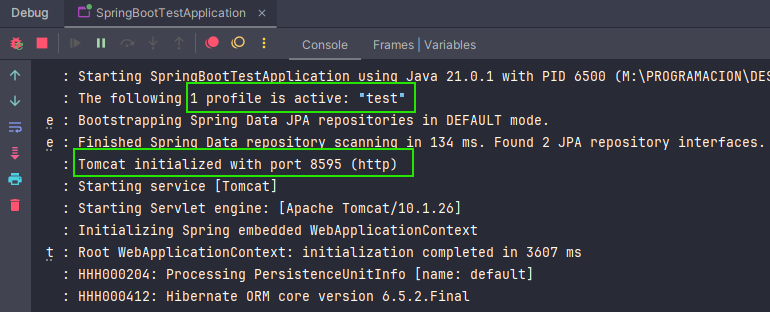

Si revisamos la base de datos, vemos que nuestras tablas, para este perfil, se han creado correctamente. Además,
manualmente agregamos registros a las dos tablas

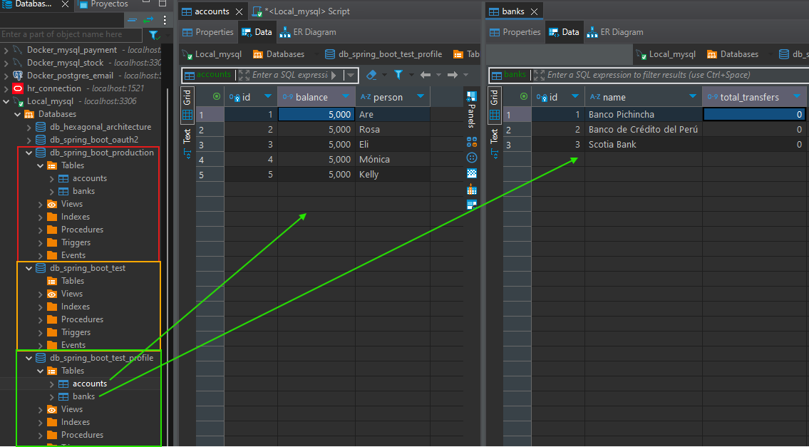

Los registros agregamos manualmente a las tablas de la base de datos `db_spring_boot_test_profile` fueron:

````sql
INSERT INTO accounts(person, balance)
VALUES('Are', 5000),
('Rosa', 5000),
('Eli', 5000),
('Mónica', 5000),
('Kelly', 5000);

INSERT INTO banks(name, total_transfers)
VALUES('Banco Pichincha', 0),
('Banco de Crédito del Perú', 0),
('Scotia Bank', 0);
````

Ahora, procedemos a ejecutar nuestros test de integración. Es importante observar que estamos levantando instancias
separadas, es decir, por un lado, tuvimos que levantar nuestra aplicación real con el perfil test y, por otro lado,
estamos ejecutando las pruebas con un puerto aleatorio.


En resumen, debemos ejecutar previamente el `Servidor de la Aplicación Backend` con el perfil `test` y, por otro lado,
ejecutar el test de integración en su propio servidor de esta manera cada servidor se ejecutará en un puerto distinto,
el de nuestro backend en el puerto `8595` y el de las pruebas de integración en uno aleatorio. Por lo que se ve en
la imagen está en el puerto `58794`.

Ahora, revisemos los registros que manualmente agregamos a la base de datos, veremos que, luego de haber ejecutar
el test de integración, los registros se vieron afectados.

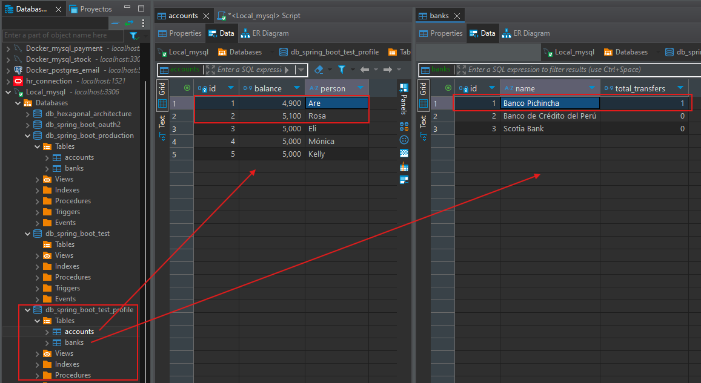

Vamos a ejecutar una vez más la prueba de integración, pero antes, veamos los registros actuales que tenemos en las
distintas bases de datos con las que estamos trabajando.

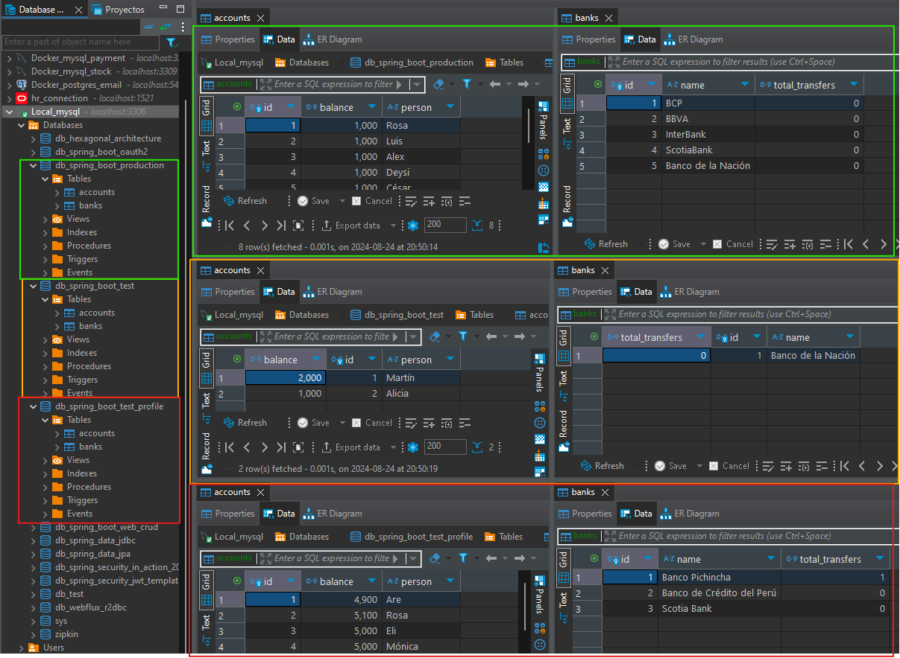

Ahora sí, ejecutemos nuevamente nuestro test de integración. Observamos que únicamente los registros que están siendo
afectados corresponden a la base de datos `db_spring_boot_test_profiles`. Esto ocurre porque en el test de integración
estamos colocando la url completa de nuestro backend con perfil `test`.

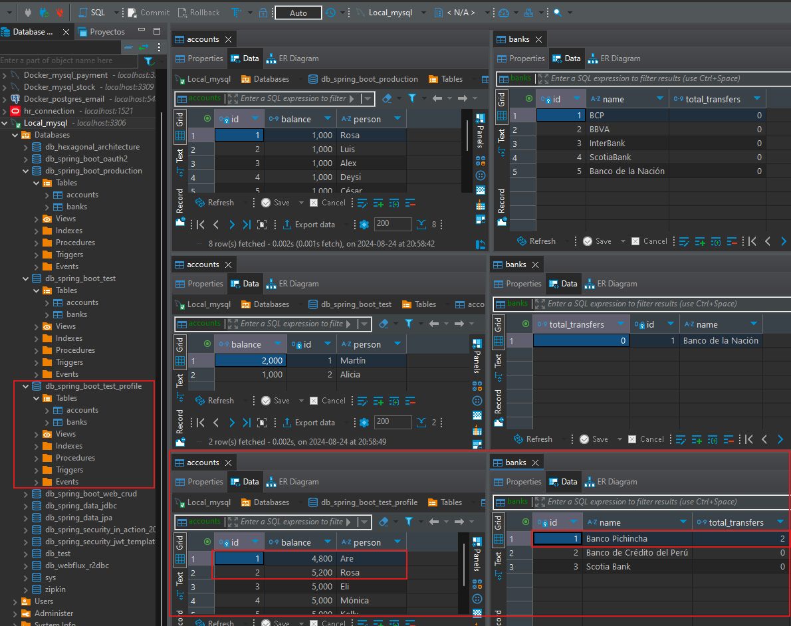

## Ejecutando nuestro test de integración - Única Instancia

Cuando nuestras `pruebas de integración estén dentro del mismo proyecto backend`, es decir, dentro del mismo proyecto
que contiene el controlador que queremos probar, `no es necesario tener levantado previamente el backend` para luego
ejecutar el test de integración, tal como lo hicimos en el capítulo anterior. Para que esto sea así, debemos modificar
el `uri()` del test para que tenga la `ruta relativa` al proyecto `uri("/api/v1/accounts/transfer")` y no la ruta
completa como lo teníamos antes.

Al colocar la `ruta relativa` en el test, por defecto, tanto el backend como el test de integración estarán en el
mismo servidor y con el mismo puerto aleatorio generado. Eso significa que ya no usaremos la aplicación real para
realizar nuestras pruebas de integración. Recordemos que cuando ejecutamos con instancias separadas, usamos la
aplicación real con perfil `test` por un lado, y por otro, nuestras pruebas de integración. Pero ahora, si utilizamos
la `ruta relativa`, nos bastaría con ejecutar únicamente las pruebas de integración sin necesidad de levantar el
backend real.

Entonces, modificamos el `uri()` de nuestra clase de test de integración por una `ruta relativa`:

````java

@SpringBootTest(webEnvironment = SpringBootTest.WebEnvironment.RANDOM_PORT)
class AccountControllerWebTestClientIntegrationTest {

    @Autowired
    private WebTestClient client;

    @Autowired
    private ObjectMapper objectMapper;

    @Test
    void shouldTransferAmountBetweenTwoAccounts() {
        // given
        Transaction dto = new Transaction(1L, 1L, 2L, new BigDecimal("100"));

        // when
        WebTestClient.ResponseSpec response = this.client
                .post()
                .uri("/api/v1/accounts/transfer")
                .contentType(MediaType.APPLICATION_JSON)
                .bodyValue(dto)
                .exchange();

        // then
        response.expectStatus().isCreated()
                .expectBody()
                .jsonPath("$.message").isNotEmpty()
                .jsonPath("$.message").value(Matchers.is("Transferencia exitosa"))
                .jsonPath("$.message").value(message -> assertEquals("Transferencia exitosa", message))
                .jsonPath("$.message").isEqualTo("Transferencia exitosa")
                .jsonPath("$.code").isEqualTo(HttpStatus.CREATED.value())
                .jsonPath("$.transaction.sourceAccountId").isEqualTo(dto.sourceAccountId())
                .jsonPath("$.datetime").value(datetime -> {
                    LocalDateTime localDateTime = LocalDateTime.parse(datetime.toString());
                    assertEquals(LocalDate.now(), localDateTime.toLocalDate());
                });
    }
}
````

Antes de ejecutar el test de integración, veamos cómo es que actualmente tenemos las distintas bases de datos para que
luego de ejecutar el test, veamos cuál de ellos es el que está interactuando con la modificación que hicimos a nuestro
test.


Vemos que al ejecutar nuestro test, todo funciona correctamente.


Ahora revisemos la base de datos y veamos cuál de ellos es el que sufrió cambios.


Como observamos, la base de datos `db_spring_boot_test` es el que sufrió los cambios y esto está bien, porque es la
base de datos que tenemos configurado en el archivo `src/test/resources/application.yml`, es decir, al estar
ejecutando las pruebas de integración como una única instancia, cogerá las configuraciones que tenemos en dicho
archivo de propiedades.

**NOTA**

> Si nuestra aplicación backend está separada de nuestros test de integración, obviamente allí sí debemos usar la ruta
> completa tal como lo hicimos en el apartado de `Instancias separadas`.

### Agrega nuevos test a nuestra clase de prueba de integración

Agregamos nuevos test a nuestra prueba de integración y luego lo ejecutamos para ver el resultado.

````java

@SpringBootTest(webEnvironment = SpringBootTest.WebEnvironment.RANDOM_PORT)
class AccountControllerWebTestClientIntegrationTest {

    @Autowired
    private WebTestClient client;

    @Autowired
    private ObjectMapper objectMapper;

    @Test
    void shouldFindAllAccountsWithJsonPath() {
        // given
        // when
        WebTestClient.ResponseSpec response = this.client
                .get()
                .uri("/api/v1/accounts")
                .exchange();

        // then
        response.expectStatus().isOk()
                .expectHeader().contentType(MediaType.APPLICATION_JSON)
                .expectBody()
                .jsonPath("$").isArray()
                .jsonPath("$").value(Matchers.hasSize(2))
                .jsonPath("$.size()").isEqualTo(2)
                .jsonPath("$[0].id").isEqualTo(1)
                .jsonPath("$[0].person").isEqualTo("Martín")
                .jsonPath("$[0].balance").isEqualTo(1880)
                .jsonPath("$[1].id").isEqualTo(2)
                .jsonPath("$[1].person").isEqualTo("Alicia")
                .jsonPath("$[1].balance").isEqualTo(1120);
    }

    @Test
    void shouldFindAnAccount() {
        // given
        Long accountId = 1L;
        Account expectedAccount = new Account(accountId, "Martín", new BigDecimal("2000"));

        // when
        WebTestClient.ResponseSpec response = this.client
                .get()
                .uri("/api/v1/accounts/{accountId}", accountId)
                .exchange();

        // then
        response.expectStatus().isOk()
                .expectBody(Account.class)
                .consumeWith(result -> {
                    Account accountResponse = result.getResponseBody();
                    assertEquals(expectedAccount, accountResponse);
                });
    }

    @Test
    void shouldFindAnAccountWithJsonPath() throws JsonProcessingException {
        // given
        Long accountId = 1L;
        Account expectedAccount = new Account(accountId, "Martín", new BigDecimal("2000"));

        // when
        WebTestClient.ResponseSpec response = this.client
                .get()
                .uri("/api/v1/accounts/{accountId}", accountId)
                .exchange();

        // then
        response.expectStatus().isOk()
                .expectHeader().contentType(MediaType.APPLICATION_JSON)
                .expectBody()
                .jsonPath("$.person").isEqualTo(expectedAccount.getPerson())
                .jsonPath("$.balance").isEqualTo(expectedAccount.getBalance().doubleValue())
                .json(this.objectMapper.writeValueAsString(expectedAccount));

    }

    @Test
    void shouldSaveAnAccountWithConsumeWith() {
        // given
        Long idDB = 3L;
        Account accountToSave = new Account(null, "Livved", new BigDecimal("3000"));

        // when
        WebTestClient.ResponseSpec response = this.client
                .post()
                .uri("/api/v1/accounts")
                .contentType(MediaType.APPLICATION_JSON)
                .bodyValue(accountToSave)
                .exchange();

        // then
        response.expectStatus().isCreated()
                .expectHeader().contentType(MediaType.APPLICATION_JSON)
                .expectHeader().location("/api/v1/accounts/" + idDB)
                .expectBody(Account.class)
                .consumeWith(result -> {
                    Account accountDB = result.getResponseBody();

                    assertNotNull(accountDB);
                    assertEquals(idDB, accountDB.getId());
                    assertEquals(accountToSave.getPerson(), accountDB.getPerson());
                    assertEquals(accountToSave.getBalance(), accountDB.getBalance());
                });
    }

    @Test
    void shouldSaveAnAccountWithJsonPath() {
        // given
        Long idDB = 4L;
        Account accountToSave = new Account(null, "María", new BigDecimal("5000"));

        // when
        WebTestClient.ResponseSpec response = this.client
                .post()
                .uri("/api/v1/accounts")
                .contentType(MediaType.APPLICATION_JSON)
                .bodyValue(accountToSave)
                .exchange();

        // then
        response.expectStatus().isCreated()
                .expectHeader().contentType(MediaType.APPLICATION_JSON)
                .expectHeader().location("/api/v1/accounts/" + idDB)
                .expectBody()
                .jsonPath("$.id").isEqualTo(idDB)
                .jsonPath("$.person").value(Matchers.is(accountToSave.getPerson()))
                .jsonPath("$.balance").isEqualTo(accountToSave.getBalance());
    }

    @Test
    void shouldTransferAmountBetweenTwoAccounts() {
        // given
        Transaction dto = new Transaction(1L, 1L, 2L, new BigDecimal("100"));

        // when
        WebTestClient.ResponseSpec response = this.client
                .post()
                .uri("/api/v1/accounts/transfer")
                .contentType(MediaType.APPLICATION_JSON)
                .bodyValue(dto)
                .exchange();

        // then
        response.expectStatus().isCreated()
                .expectBody()
                .jsonPath("$.message").isNotEmpty()
                .jsonPath("$.message").value(Matchers.is("Transferencia exitosa"))
                .jsonPath("$.message").value(message -> assertEquals("Transferencia exitosa", message))
                .jsonPath("$.message").isEqualTo("Transferencia exitosa")
                .jsonPath("$.code").isEqualTo(HttpStatus.CREATED.value())
                .jsonPath("$.transaction.sourceAccountId").isEqualTo(dto.sourceAccountId())
                .jsonPath("$.datetime").value(datetime -> {
                    LocalDateTime localDateTime = LocalDateTime.parse(datetime.toString());
                    assertEquals(LocalDate.now(), localDateTime.toLocalDate());
                });
    }

    @Test
    void shouldTransferAmountBetweenTwoAccountsWithConsumeWith() {
        // given
        Transaction dto = new Transaction(1L, 1L, 2L, new BigDecimal("100"));

        // when
        WebTestClient.ResponseSpec response = this.client
                .post()
                .uri("/api/v1/accounts/transfer")
                .contentType(MediaType.APPLICATION_JSON)
                .bodyValue(dto)
                .exchange();

        // then
        response.expectStatus().isCreated()
                .expectBody()
                .consumeWith(result -> {
                    try {
                        JsonNode jsonNode = this.objectMapper.readTree(result.getResponseBody());

                        assertEquals("Transferencia exitosa", jsonNode.path("message").asText());
                        assertEquals(HttpStatus.CREATED.value(), jsonNode.path("code").asInt());
                    } catch (IOException e) {
                        throw new RuntimeException(e);
                    }
                });
    }

    @Test
    void shouldDeletedAnAccount() {
        // given
        Long idToDelete = 1L;

        // when
        WebTestClient.ResponseSpec response = this.client
                .delete()
                .uri("/api/v1/accounts/{accountId}", idToDelete)
                .exchange();

        // then
        response.expectStatus().isNoContent()
                .expectBody().isEmpty();

        this.client
                .get()
                .uri("/api/v1/accounts/{accountId}", idToDelete)
                .exchange()
                .expectStatus().isNotFound()
                .expectBody()
                .consumeWith(result -> {
                    HttpStatusCode status = result.getStatus();

                    assertTrue(status.isError());
                    assertEquals(404, status.value());
                });
    }
}
````

Ahora ejecutamos los test de integración y observamos los resultados. Vemos que hay test que no han pasado la
validación. `¿Qué está pasando?`


Como ahora tenemos implementado varios test que están interactuando con la misma base de dados, ocurre que algunos test
que se ejecutan primero pueden manipulan los registros, de tal manera que cuando se ejecuta un siguiente test, puede
fallar, ya que el estado de la base de datos no es la misma con la que se inició, por lo tanto, habría que ver la manera
de como ejecutar cada método de test sin que la ejecución de un método anterior afecte su funcionamiento.

**NOTA**

> Entonces, como recomendación, cuando ejecutemos nuestras `pruebas de integración` donde algunos test modifican
> datos de la base de datos, podríamos dar algún tipo de prioridad, es decir, definir que se ejecute un método
> determinado, luego otro y así (darle un orden a los test), pero solo en pruebas de integración, para que un
> método que se ejecutó antes no afecte a otro método que se ejecutará después.
>
> Más adelante veremos cómo evitar dar un orden a la ejecución de métodos, pero por ahora, veamos que darle un orden
> es una manera de poder solucionar el error anterior.

## Test de Integración - Agregando @Order a los @Test

Como se vio en la sección anterior, cuando ejecutamos nuestros `test de integración` los test puede verse afectados por
la ejecución de otros test, así que para solucionar ese inconveniente le daremos un orden a cada método test, pero solo
cuando realicemos más de una `prueba de integración`.

Utilizaremos las siguientes anotaciones:

- `@TestMethodOrder`, es una anotación de nivel de tipo que se usa para configurar un `MethodOrderer` para los métodos
  de prueba de la clase de prueba anotada o la interfaz de prueba. En este contexto, el término `"método de prueba"` se
  refiere a cualquier método anotado con `@Test`, `@RepeatedTest`, `@ParameterizedTest`, `@TestFactory` o
  `@TestTemplate`.


- `@Order`, es una anotación que se utiliza para configurar el orden en que el elemento anotado (es decir, campo,
  método o clase) debe evaluarse o ejecutarse en relación con otros elementos de la misma categoría.
  Cuando se usa con `@RegisterExtension` o `@ExtendWith`, la categoría se aplica a los campos de extensión. Cuando se
  usa con `MethodOrderer.OrderAnnotation`, la categoría se aplica a los métodos de prueba. Cuando se usa con
  `ClassOrderer.OrderAnnotation`, la categoría se aplica a las clases de prueba.

A continuación, se muestra toda la clase test con sus métodos test ordenados con la anotación `@Order()`, además con
la modificación de los `asserts esperados`:

````java
import org.junit.jupiter.api.Order;

@TestMethodOrder(MethodOrderer.OrderAnnotation.class)
@SpringBootTest(webEnvironment = SpringBootTest.WebEnvironment.RANDOM_PORT)
class AccountControllerWebTestClientIntegrationTest {

    @Autowired
    private WebTestClient client;

    @Autowired
    private ObjectMapper objectMapper;

    @Test
    @Order(1)
    void shouldFindAllAccountsWithJsonPath() {
    }

    @Test
    @Order(2)
    void shouldFindAnAccount() {
    }

    @Test
    @Order(3)
    void shouldFindAnAccountWithJsonPath() throws JsonProcessingException {
    }

    @Test
    @Order(4)
    void shouldSaveAnAccountWithConsumeWith() {
    }

    @Test
    @Order(5)
    void shouldSaveAnAccountWithJsonPath() {
    }

    @Test
    @Order(6)
    void shouldTransferAmountBetweenTwoAccounts() {
    }

    @Test
    @Order(7)
    void shouldTransferAmountBetweenTwoAccountsWithConsumeWith() {
    }

    @Test
    @Order(8)
    void shouldDeletedAnAccount() {
    }
}
````

Luego de haber dado un orden a cada método de test y verificado que los `asserts` sean los esperados, ejecutamos toda
la prueba de integración. Como vemos, las pruebas se han ejecutado sin ningún problema.


---

# Sección 8: Pruebas de Integración de Controladores Rest con TestRestTemplate

---

## Pruebas de Integración con TestRestTemplate

Crearemos nuestra clase de prueba a partir del controlador `AccountController` presionando las teclas
`Ctrl + Shift + T`. Las configuraciones serán las mismas que utilizamos en las `pruebas de integración` usando
`WebTestClient`, con algunas diferencias:

1. Como ahora utilizaremos `TestRestTemplate` necesitamos definirlo como una propiedad en la clase de prueba que será
   inyectada con `@Autowired`.


2. En las pruebas de Integración usando `WebTestClient` usamos las anotaciones `@TestMethodOrder()` y `@Order()`, con la
   finalidad de determinar el orden de ejecución de los test. Con esto evitábamos que la ejecución de un test que
   modificaba la base de datos no afectara la ejecución de otro test que usaba los mismos datos. Pues bien, en esta
   nueva sección ya no usaremos esas anotaciones para ordenar los test, sino más bien, usaremos la anotación `@Sql()`
   junto con algunos `scripts SQL` para tener los datos de pruebas siempre en un mismo estado.

### TestRestTemplate

Alternativa conveniente de `RestTemplate` que es adecuada para `pruebas de integración`. `TestRestTemplate` es tolerante
a fallas. Esto significa que `4xx` y `5xx` no generan una excepción y, en cambio, pueden detectarse a través de la
entidad de respuesta y su código de estado.

Un `TestRestTemplate` puede llevar opcionalmente encabezados de autenticación básicos. Si `Apache Http Client 4.3.2` o
superior está disponible (recomendado), se utilizará como cliente y, de forma predeterminada, se configurará para
ignorar las cookies y los redireccionamientos.

`Nota:` para evitar problemas de inyección, esta clase no extiende intencionadamente `RestTemplate`. Si necesita acceder
al `RestTemplate` subyacente, use `getRestTemplate()`.

Si está utilizando la anotación `@SpringBootTest` con un servidor integrado, un `TestRestTemplate` está disponible
automáticamente y se puede inyectar con el `@Autowired` en su prueba. Si necesita personalizaciones (por ejemplo,
para agregar convertidores de mensajes adicionales), use `RestTemplateBuilder @Bean`.

### [Ejecutando Scripts SQL](https://docs.spring.io/spring-framework/reference/testing/testcontext-framework/executing-sql.html#testcontext-executing-sql-declaratively-script-detection)

Cuando se escriben `pruebas de integración` en una base de datos relacional, **suele ser beneficioso ejecutar
secuencias de comandos SQL para modificar el esquema de la base de datos o insertar datos de prueba en las tablas.**

El módulo `spring-jdbc` brinda soporte para inicializar una base de datos incrustada o existente mediante la ejecución
de secuencias de comandos `SQL` cuando se carga `Spring ApplicationContext`.

Aunque es muy útil inicializar una base de datos para probar una vez que se carga `ApplicationContext`, a veces es
esencial poder `modificar la base de datos durante las pruebas de integración`.

### Ejecutar scripts SQL declarativamente con @Sql

Puede declarar la anotación `@Sql` en una `clase` de prueba o `método` de prueba para configurar instrucciones `SQL`
individuales o las rutas de recursos a `scripts SQL` que deben ejecutarse en una base de datos determinada antes o
después de un método de `prueba de integración`.

### Semántica de recursos de ruta

Cada ruta se interpreta como un recurso Spring:

- Una ruta simple, por ejemplo: `schema.sql` se trata como un recurso de ruta de clase `relativo` al paquete en el
  que se define la clase de prueba.


- Una ruta que comienza con una barra inclinada se trata como un recurso de ruta de clase `absoluta`, por ejemplo:
  `/org/example/schema.sql`.


- Una ruta que hace referencia a una URL, por ejemplo: una ruta con el prefijo `classpath:`, `file:`, `http:`, se carga
  utilizando el protocolo de recursos especificado.

Si queremos ubicar nuestros `Scripts SQL` en el directorio `/test/resources` y dentro de él crear un subdirectorio
llamado `/account-script`, debemos usar la siguiente semántica de recursos de ruta:

````bash
@Sql(scripts = {"/account-script/test-account-cleanup.sql", "/account-script/test-account-data.sql"}, executionPhase = Sql.ExecutionPhase.BEFORE_TEST_METHOD)
````

La semántica definida anteriormente hará referencia a la siguiente ruta:

````bash
src/test/resources/account-script/test-account-cleanup.sql
src/test/resources/account-script/test-account-data.sql
````

Ahora, en nuestro caso hemos definido dos scripts sql, el primero hará un `truncate` a cada una de las dos tablas y el
segundo script poblará las tablas `accounts` y `banks`. Estos dos scripts se ejecutarán antes de cada método de prueba
individual.

````sql
# test-account-cleanup.sql
#
TRUNCATE TABLE banks;
TRUNCATE TABLE accounts;
````

````sql
# test-account-data.sql
#
INSERT INTO banks(name, total_transfers) VALUES('Banco de la Nación', 0);
INSERT INTO banks(name, total_transfers) VALUES('Banco BBVA', 0);
INSERT INTO banks(name, total_transfers) VALUES('Banco BCP', 0);

INSERT INTO accounts(person, balance) VALUES('Andrés', 3000);
INSERT INTO accounts(person, balance) VALUES('Pedro', 3000);
INSERT INTO accounts(person, balance) VALUES('Liz', 3000);
INSERT INTO accounts(person, balance) VALUES('Karen', 3000);
````

Para que nuestros scripts y declaraciones `SQL` configurados en la anotación `@Sql`, se ejecuten antes que el método
de prueba correspondiente, debemos usar la siguiente configuración
`executionPhase = Sql.ExecutionPhase.BEFORE_TEST_METHOD`.

En resumen, con esta anotación:

````bash
@Sql(scripts = {"/account-script/test-account-cleanup.sql", "/account-script/test-account-data.sql"}, executionPhase = Sql.ExecutionPhase.BEFORE_TEST_METHOD)
````

Estamos indicando que antes de ejecutar cada método de prueba, se ejecuten los scripts SQL mencionados. Esto puede ser
útil para preparar la base de datos con datos de prueba o limpiarla después de la ejecución de cada prueba, asegurando
que las pruebas se ejecuten en un estado predecible y limpio.

A continuación se muestran todos los test desarrollados utilizando el `RestTestTemplate`.

````java

@Sql(scripts = {"/account-script/test-account-cleanup.sql", "/account-script/test-account-data.sql"}, executionPhase = Sql.ExecutionPhase.BEFORE_TEST_METHOD)
@SpringBootTest(webEnvironment = SpringBootTest.WebEnvironment.RANDOM_PORT)
class AccountControllerTestRestTemplateIntegrationTest {

    @Autowired
    private TestRestTemplate client;

    @Autowired
    private ObjectMapper objectMapper;

    @Test
    void shouldFindAllAccounts() throws IOException {
        // given
        // when
        ResponseEntity<Account[]> response = this.client.getForEntity("/api/v1/accounts", Account[].class);
        Account[] accountsDB = response.getBody();

        // then
        assertEquals(HttpStatus.OK, response.getStatusCode());
        assertEquals(MediaType.APPLICATION_JSON, response.getHeaders().getContentType());
        assertNotNull(accountsDB);
        assertEquals(4, accountsDB.length);
        assertEquals(1L, accountsDB[0].getId());
        assertEquals("Andrés", accountsDB[0].getPerson());
        assertEquals(3000D, accountsDB[0].getBalance().doubleValue());

        JsonNode jsonNode = this.objectMapper.readTree(this.objectMapper.writeValueAsBytes(accountsDB));
        assertEquals(3L, jsonNode.get(2).path("id").asLong());
        assertEquals("Liz", jsonNode.get(2).path("person").asText());
        assertEquals(3000D, jsonNode.get(2).path("balance").asDouble());
    }

    @Test
    void shouldFindAnAccount() {
        // given
        Long accountId = 4L;
        Account expectedAccount = new Account(accountId, "Karen", new BigDecimal("3000"));

        // when
        ResponseEntity<Account> response = this.client.getForEntity("/api/v1/accounts/{accountId}", Account.class, accountId);
        Account accountResponse = response.getBody();

        // then
        assertEquals(HttpStatus.OK, response.getStatusCode());
        assertEquals(MediaType.APPLICATION_JSON, response.getHeaders().getContentType());
        assertNotNull(accountResponse);
        assertEquals(expectedAccount.getId(), accountResponse.getId());
        assertEquals(expectedAccount.getPerson(), accountResponse.getPerson());
        assertEquals(expectedAccount.getBalance().doubleValue(), accountResponse.getBalance().doubleValue());
        assertEquals(expectedAccount, accountResponse);
    }

    @Test
    void shouldSaveAnAccount() {
        // given
        Long expectedId = 5L;
        Account accountToSave = new Account(null, "Nophy", new BigDecimal("3000"));

        // when
        ResponseEntity<Account> response = this.client.postForEntity("/api/v1/accounts", accountToSave, Account.class);
        Account accountResponse = response.getBody();

        // then
        assertEquals(HttpStatus.CREATED, response.getStatusCode());
        assertEquals(MediaType.APPLICATION_JSON, response.getHeaders().getContentType());
        assertNotNull(accountResponse);
        assertEquals(expectedId, accountResponse.getId());
        assertEquals(accountToSave.getPerson(), accountResponse.getPerson());
        assertEquals(accountToSave.getBalance().doubleValue(), accountResponse.getBalance().doubleValue());
    }

    @Test
    void shouldTransferAmountBetweenTwoAccounts() throws JsonProcessingException {
        // given
        Transaction dto = new Transaction(1L, 1L, 2L, new BigDecimal("100"));

        // when
        ResponseEntity<String> response = this.client.postForEntity("/api/v1/accounts/transfer", dto, String.class);
        String jsonString = response.getBody();
        JsonNode jsonNode = this.objectMapper.readTree(jsonString);

        // then
        assertNotNull(jsonString);
        assertEquals(HttpStatus.CREATED, response.getStatusCode());
        assertEquals(MediaType.APPLICATION_JSON, response.getHeaders().getContentType());
        assertEquals("Transferencia exitosa", jsonNode.get("message").asText());
    }

    @Test
    void shouldDeletedAnAccountWithExchange() {
        // given
        Long idToDelete = 1L;

        // when
        ResponseEntity<Void> response = this.client.exchange("/api/v1/accounts/{accountId}", HttpMethod.DELETE, null, Void.class, idToDelete);

        // then
        assertEquals(HttpStatus.NO_CONTENT, response.getStatusCode());
        assertFalse(response.hasBody());

        ResponseEntity<Account> responseAccount = this.client.getForEntity("/api/v1/accounts/{accountId}", Account.class, idToDelete);
        assertNull(responseAccount.getBody());
        assertEquals(HttpStatus.NOT_FOUND, responseAccount.getStatusCode());
        assertFalse(responseAccount.hasBody());
    }

    @Test
    void shouldDeletedAnAccountWithDelete() {
        // given
        Long idToDelete = 1L;
        ResponseEntity<Account> responseAccount = this.client.getForEntity("/api/v1/accounts/{accountId}", Account.class, idToDelete);
        assertNotNull(responseAccount.getBody());
        assertEquals(HttpStatus.OK, responseAccount.getStatusCode());
        assertTrue(responseAccount.hasBody());

        // when
        this.client.delete("/api/v1/accounts/{accountId}", idToDelete);

        // then
        responseAccount = this.client.getForEntity("/api/v1/accounts/{accountId}", Account.class, idToDelete);
        assertNull(responseAccount.getBody());
        assertEquals(HttpStatus.NOT_FOUND, responseAccount.getStatusCode());
        assertFalse(responseAccount.hasBody());
    }
}
````

Antes de ejecutar esta nueva clase de test de integración, vamos a agregar algunas configuraciones adicionales al
archivo `src/test/resources/application.yml` para poder ver en detalle las consultas que se ejecutan, qué parámetros se
están enviando y qué archivos sql se están ejecutando.

````yml
logging:
  level:
    org.hibernate.SQL: DEBUG                          # Permite ver la consulta SQL en consola
    org.hibernate.orm.jdbc.bind: TRACE                # Permite ver los parámetros de la consulta SQL
    org.springframework.jdbc.datasource.init: DEBUG   # Permite ver qué declaraciones SQL se están ejecutando
````

Ahora sí, procedemos a ejecutar la nueva clase de test de integración y veamos los resultados. Observemos que
lo marcado en cuadro amarillo corresponde a la ejecución del script `src/test/resources/import.sql` que lo hace
automáticamente hibernate gracias a la configuración `spring.jpa.hibernate.ddl-auto: create` cuando se inicia el
servidor, pero nuestros métodos de test de integración no trabajan con esos datos, sino más bien con los que agregamos
al script `test-account-data.sql`. Precisamente, luego de iniciar el servidor, se empieza a ejecutar nuestro test de
integración, ejecutando en primer lugar el script `test-account-cleanup.sql` y luego `test-account-data.sql`. Esto lo
hará para cada método de prueba, de esa manera cada método de test tendrá los mismos datos para la ejecución de su
prueba, independientemente de si algún otro método test ha modificado los datos o no, la base de datos siempre tendrá
el mismo estado al iniciar un método test.

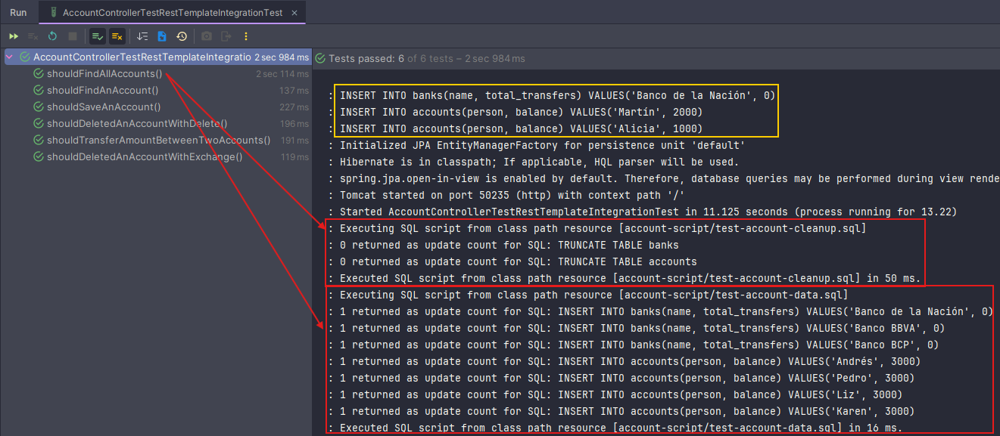

## Test de integración - Única Instancia y Ruta Absoluta

En el apartado `Ejecutando nuestro test de integración - Única Instancia` decíamos que para poder ejecutar nuestros
test de integración sin la necesidad de iniciar previamente nuestro backend, debíamos reemplazar nuestro
`path absoluto`:

````bash
.uri("http://localhost:8595/api/v1/accounts/transfer")
````

Por un `path relativo`:

````bash
.uri("/api/v1/accounts/transfer")
````

De esta manera solo ejecutamos los test de integración y por debajo se levantaba nuestro backend en el mismo puerto
aleatorio definido para las pruebas, es decir, ejecutamos los test de integración en una única instancia.

Ahora, la pregunta es **¿se puede colocar la ruta absoluta y ejecutar los test de integración sin la necesidad de
levantar previamente el backend?**, la respuesta es `sí`, solo tenemos que averiguar cuál es el puerto aleatorio
que se genera cuando ejecutamos los test de integración y eso lo podemos hacer utilizando la anotación
`@LocalServerPort`.

### @LocalServerPort

Anotación en el nivel de parámetro de campo o método/constructor que inyecta el `puerto del servidor HTTP` que se
`asignó en tiempo de ejecución`. Proporciona una alternativa conveniente para `@Value("${local.server.port}")`. Está
diseñado específicamente para inyectar el puerto del servidor embebido durante las `pruebas de integración`.

Listo, con esa explicación previa, vamos a crear:

- Una variable anotada con `@LocalServerPort` para inyectar el puerto asignado en tiempo de ejecución.
- Usar la anotación `@PostConstruct` para inicializar la `ruta completa` con el puerto obtenido.
- Reemplazamos todas las uris de los métodos test con nuestro path absoluto.

````java

@Sql(scripts = {"/account-script/test-account-cleanup.sql", "/account-script/test-account-data.sql"}, executionPhase = Sql.ExecutionPhase.BEFORE_TEST_METHOD)
@SpringBootTest(webEnvironment = SpringBootTest.WebEnvironment.RANDOM_PORT)
class AccountControllerTestRestTemplateIntegrationTest {

    @Autowired
    private TestRestTemplate client;

    @Autowired
    private ObjectMapper objectMapper;

    @LocalServerPort    //<-- Inyecta el puerto asignado en tiempo de ejecución
    private int port;

    private String absolutePathOfAccounts;

    @PostConstruct
    public void init() {
        this.absolutePathOfAccounts = "http://localhost:%d/api/v1/accounts".formatted(this.port);
    }

    @Test
    void shouldFindAnAccount() {
        // given
        Long accountId = 4L;
        Account expectedAccount = new Account(accountId, "Karen", new BigDecimal("3000"));

        // when
        ResponseEntity<Account> response = this.client.getForEntity(this.absolutePathOfAccounts + "/{accountId}", Account.class, accountId);
        Account accountResponse = response.getBody();

        // then
        assertEquals(HttpStatus.OK, response.getStatusCode());
        assertEquals(MediaType.APPLICATION_JSON, response.getHeaders().getContentType());
        assertNotNull(accountResponse);
        assertEquals(expectedAccount.getId(), accountResponse.getId());
        assertEquals(expectedAccount.getPerson(), accountResponse.getPerson());
        assertEquals(expectedAccount.getBalance().doubleValue(), accountResponse.getBalance().doubleValue());
        assertEquals(expectedAccount, accountResponse);
    }

    /* other methods */
}
````

Si ahora ejecutamos nuestra prueba de integración veremos que todo estará funcionando sin problemas, pero ahora
estamos utilizando la ruta absoluta en una única instancia.

## Excluir clases de prueba mediante tag

Puede ser que tengamos un caso donde queremos correr todos los test exceptuando algunos, para esa situación
podríamos apoyarnos de los `@Tag()`, le damos un valor y configuramos nuestro ide para excluir el tag.

````java

@Tag(value = "integration_test_webtestclient")
@TestMethodOrder(MethodOrderer.OrderAnnotation.class)
@SpringBootTest(webEnvironment = SpringBootTest.WebEnvironment.RANDOM_PORT)
class AccountControllerWebTestClientIntegrationTest {
    /* ommitted code */
}
````

## Ejecutando tests desde IDE IntelliJ IDEA excluyendo clases de prueba

Para ejecutar todos los test del proyecto, excluyendo algunas clases de prueba, debemos hacer lo siguiente:

- Edit configurations...
- Seleccionar el combo box la opción `Tags`
- En la casilla del costado agregamos el nombre del tag, como queremos excluir usaremos el signo de admiración `!`,
  ejemplo: `!integration_test_webtestclient`.

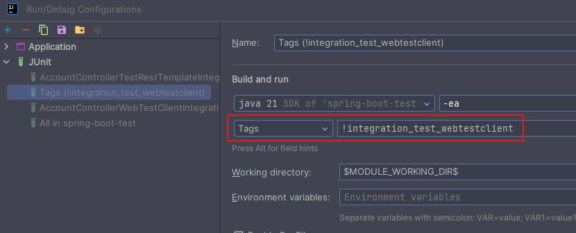

Ahora, procedemos a ejecutar todos los test de nuestro proyecto y veremos que no aparece el test que hemos excluído.

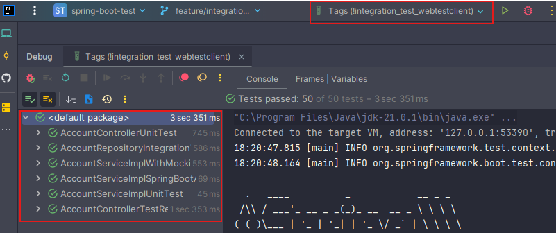

## Ejecutando tests desde consola excluyendo clases de prueba

Primero ejecutaremos todos nuestros test sin excluir ninguno. Para eso utilizaremos el siguiente comando:

````bash
$ mvn test
````

Como observamos, vemos que la clase de prueba `AccountControllerWebTestClientIntegrationTest` está fallando. Bueno,
sí esperábamos que falle, dado que esta clase de prueba lo creamos en función de los registros definidos en el archivo
`src/test/resources/import.sql`, pero como también hemos construido la clase de prueba
`AccountControllerTestRestTemplateIntegrationTest`, es esta última clase de prueba el que está modificando los datos
por eso es que está fallando los test de la primera clase mencionada.

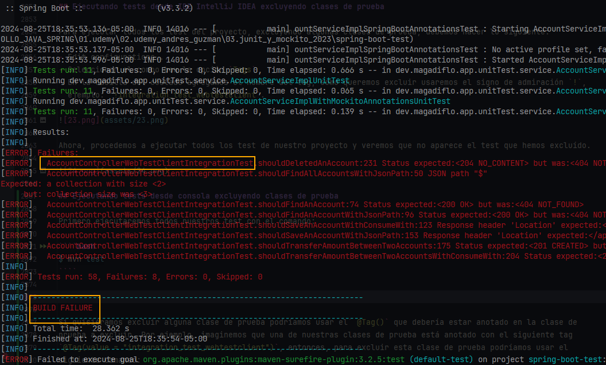

Entonces, si quisiéramos excluir alguna clase de prueba podríamos usar el` @Tag()` que debería estar anotado en la
clase de prueba a excluir. Por ejemplo, en nuestro caso debe estar anotado en la clase de prueba
`AccountControllerWebTestClientIntegrationTest`
el tag con un nombre específico `@Tag(value = "integration_test_webtestclient")`, de esa manera podremos excluir
dicha clase de prueba. Ahora, el comando a utilizar sería el siguiente:

````bash
$ mvn test -D groups=!integration_test_webtestclient
````

El comando `mvn test -D groups=!integration_test_webtestclient` ejecuta las pruebas unitarias y de integración en un
proyecto Maven, excluyendo aquellas pruebas que pertenecen al grupo de pruebas `integration_test_webtestclient`.

Aquí te explico cada parte del comando:

- `mvn test`, ejecuta las pruebas en el proyecto Maven.

- `-D groups=!integration_test_webtestclient`, esta es una propiedad que se pasa al Maven para definir grupos de pruebas
  que se deben o no se deben ejecutar. La opción `-D` se utiliza para definir una propiedad del sistema. En este caso,
  `groups=!integration_test_webtestclient` le indica a Maven que no ejecute las pruebas que están anotadas con el grupo
  `integration_test_webtestclient`.

Listo, luego de ejecutar el comando anterior, podemos ver que todos los test han pasado exitosamente excluyendo la clase
de prueba que nos estaba dando error.

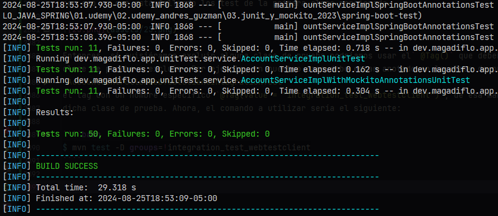

---

# Prueba de Integración al AccountController usando MockMvc

---

En secciones anteriores realizamos `pruebas unitarias` a nuestro controlador `AccountController` utilizando
`MockMvc`. Decíamos que esta clase se puede utilizar para invocar al controlador simulando la llamada HTTP sin tener
que arrancar realmente ningún servidor web, es decir `simulábamos el request y response`. Además, nos apoyábamos de
la anotación `@MockBean` para simular la dependencia `IAccountService` que requiere el controlador y a través del
uso de `Mockito` simulamos la respuesta que nos debería retornar cuando algún método de esta dependencia fuese
llamada.

Pues bien, en esta sección volveremos a usar `MockMvc` para poder realizar solicitudes `HTTP` al controlador
`AccountController`, pero en esta oportunidad realizaremos `pruebas de integración`, es decir, se ejecutará nuestro
código desde la primera capa donde se expone nuestros datos (end points), hasta la última capa donde se recogen los
datos o manipulan los datos obtenidos de la Base de Datos. Para que esto funcione es necesario utilizar algunas
anotaciones distintas al que usamos en la realización de pruebas unitarias.

A continuación se mostrarán las anotaciones más relevantes:

### @SpringBootTest

En secciones superiores explicamos el uso de esta anotación, pero solo para recordar dijimos que `Spring Boot`
proporciona esta anotación `(@SpringBootTest)` para realizar `pruebas de integración`. Esta anotación crea un contexto
de aplicación y carga el contexto completo de la aplicación.

### webEnvironment = SpringBootTest.WebEnvironment.RANDOM_PORT

Esta propiedad selecciona un puerto aleatorio para el servidor web durante la prueba.

### @AutoConfigureMockMvc

Anotación que se puede aplicar a una clase de prueba para habilitar y configurar la configuración automática de
`MockMvc`.

### MockMvc

`MockMvc` ofrece una interfaz para realizar solicitudes `HTTP (GET, POST, PUT, DELETE, etc.)` a los endpoints de
nuestros controladores y obtener las respuestas simuladas. Ahora, en este caso ya no obtendremos respuestas simuladas,
sino respuestas reales con datos reales, pues las llamadas HTTP se realizarán a nuestro servidor de pruebas que se crea
gracias a la anotación `@SpringBootTest`.

Finalmente, nuestra clase de `prueba de integración` utilizando `MockMvc` quedaría de la siguiente manera:

````java

@Sql(scripts = {"/account-script/test-account-cleanup.sql", "/account-script/test-account-data.sql"}, executionPhase = Sql.ExecutionPhase.BEFORE_TEST_METHOD)
@AutoConfigureMockMvc
@SpringBootTest(webEnvironment = SpringBootTest.WebEnvironment.RANDOM_PORT)
class AccountControllerMockMvcIntegrationTest {

    @Autowired
    private MockMvc mockMvc;

    @Autowired
    private ObjectMapper objectMapper;

    @LocalServerPort
    private int port;

    private String absolutePathOfAccounts;

    @PostConstruct
    public void init() {
        this.absolutePathOfAccounts = "http://localhost:%d/api/v1/accounts".formatted(this.port);
    }

    @Test
    void shouldFindAllAccounts() throws Exception {
        // given
        // when
        ResultActions response = this.mockMvc.perform(get(this.absolutePathOfAccounts));

        // then
        response.andExpect(status().isOk())
                .andExpect(content().contentType(MediaType.APPLICATION_JSON))
                .andExpect(jsonPath("$[0].person").value("Andrés"))
                .andExpect(jsonPath("$[0].balance").value(3000))
                .andExpect(jsonPath("$[1].person").value("Pedro"))
                .andExpect(jsonPath("$[1].balance").value(3000))
                .andExpect(jsonPath("$[2].person").value("Liz"))
                .andExpect(jsonPath("$[2].balance").value(3000))
                .andExpect(jsonPath("$[3].person").value("Karen"))
                .andExpect(jsonPath("$[3].balance").value(3000))
                .andExpect(jsonPath("$.size()", Matchers.is(4)))
                .andExpect(jsonPath("$", Matchers.hasSize(4)));
    }

    @Test
    void shouldSaveAnAccount() throws Exception {
        // given
        Account account = Account.builder()
                .person("Martín")
                .balance(new BigDecimal("3000"))
                .build();

        // when
        ResultActions response = this.mockMvc.perform(post(this.absolutePathOfAccounts)
                .contentType(MediaType.APPLICATION_JSON)
                .content(this.objectMapper.writeValueAsString(account)));

        // then
        response.andExpect(status().isCreated())
                .andExpect(content().contentType(MediaType.APPLICATION_JSON))
                .andExpect(header().string("Location", "/api/v1/accounts/5"))
                .andExpect(jsonPath("$.id", Matchers.is(5)))
                .andExpect(jsonPath("$.person", Matchers.is("Martín")))
                .andExpect(jsonPath("$.balance", Matchers.is(3000)));
    }

    @Test
    void shouldFindAnAccount() throws Exception {
        // given
        Long accountId = 1L;

        // when
        ResultActions response = this.mockMvc.perform(get(this.absolutePathOfAccounts + "/{accountId}", accountId));

        // then
        response.andExpect(status().isOk())
                .andExpect(content().contentType(MediaType.APPLICATION_JSON))
                .andExpect(jsonPath("$.id").value(accountId))
                .andExpect(jsonPath("$.person").value("Andrés"))
                .andExpect(jsonPath("$.balance").value(3000));
    }

    @Test
    void shouldReturnEmptyWhenAccountDoesNotExist() throws Exception {
        // Given
        Long accountId = 10L;

        // When
        ResultActions response = this.mockMvc.perform(get(this.absolutePathOfAccounts + "/{accountId}", accountId));

        // Then
        response.andExpect(status().isNotFound());
    }

    @Test
    void shouldReturnANotFoundStatusWhenTheAccountDoesNotExist() throws Exception {
        // given
        Long accountId = 100L;

        // when
        ResultActions response = this.mockMvc.perform(get(this.absolutePathOfAccounts + "/{accountId}", accountId));

        // then
        response.andExpect(status().isNotFound());
    }

    @Test
    void shouldTransferAnAmountBetweenAccounts() throws Exception {
        // given
        Transaction dto = new Transaction(1L, 1L, 2L, new BigDecimal("100"));

        // when
        ResultActions response = this.mockMvc.perform(post(this.absolutePathOfAccounts + "/transfer")
                .contentType(MediaType.APPLICATION_JSON)
                .content(this.objectMapper.writeValueAsString(dto)));

        // then
        response.andExpect(status().isCreated())
                .andExpect(content().contentType(MediaType.APPLICATION_JSON))
                .andExpect(jsonPath("$.code").value(HttpStatus.CREATED.value()))
                .andExpect(jsonPath("$.datetime").exists())
                .andExpect(jsonPath("$.message").value("Transferencia exitosa"))
                .andExpect(jsonPath("$.transaction.sourceAccountId").value(dto.sourceAccountId()));

        String jsonResponse = response.andReturn().getResponse().getContentAsString();
        JsonNode jsonNode = this.objectMapper.readTree(jsonResponse);

        String dateTime = jsonNode.get("datetime").asText();
        LocalDateTime localDateTime = LocalDateTime.parse(dateTime);

        assertEquals(LocalDate.now(), localDateTime.toLocalDate());
    }

    @Test
    void shouldDeletedAnAccountWithDelete() throws Exception {
        // given
        Long idToDelete = 1L;

        // when
        ResultActions responseDelete = this.mockMvc.perform(delete(this.absolutePathOfAccounts + "/{accountId}", idToDelete));

        // then
        responseDelete.andExpect(status().isNoContent());
        ResultActions responseGet = this.mockMvc.perform(get(this.absolutePathOfAccounts + "/{accountId}", idToDelete));
        responseGet.andExpect(status().isNotFound());
    }
}
````

Si ejecutamos la prueba de integración anterior, veremos que todo se está ejecutando sin problemas, de esta forma
estamos validando que el `MockMvc` no solo se puede usar para realizar pruebas unitarias a nuestros endpoints, sino
también pruebas de integración como en este caso.


## Ejecuta pruebas unitarias y de integración de todo el proyecto

Habiendo finalizado la creación de las pruebas unitarias y de integración, vamos a ejecutarlas todas para ver cómo es
que se muestra en nuestro ide y también en consola.

En nuestro `IDE de IntelliJ IDEA` se muestra de esta manera, teniendo en cuenta que estamos excluyendo la clase
`AccountControllerWebTestClientIntegrationTest`.

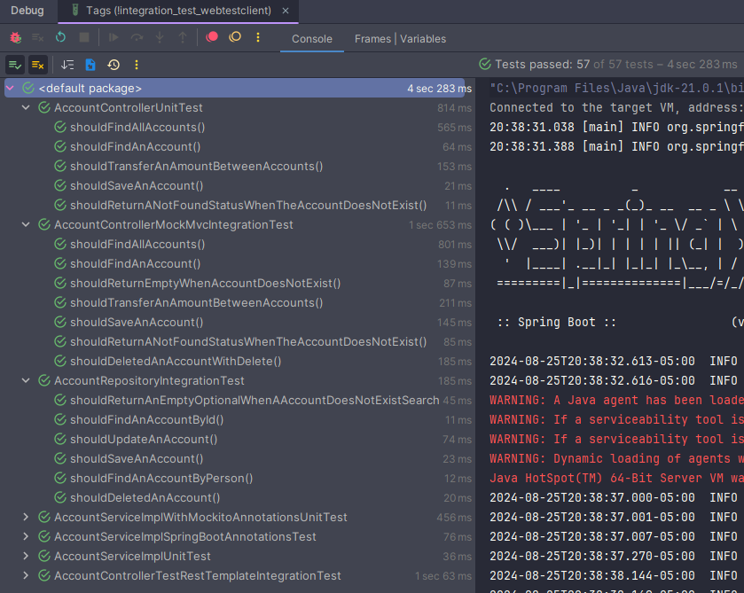

Si ejecutamos en `consola` todos los test de nuestro proyecto, excluyendo la clase antes mencionada, el resultado se vería
de esta manera.

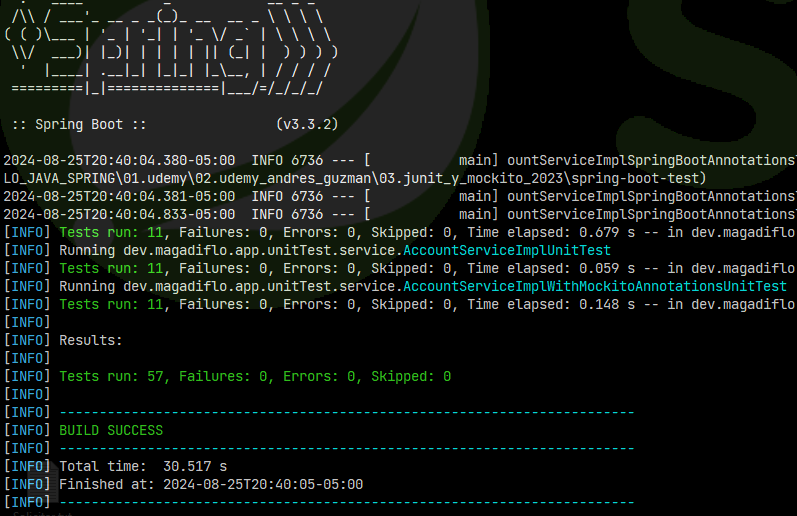